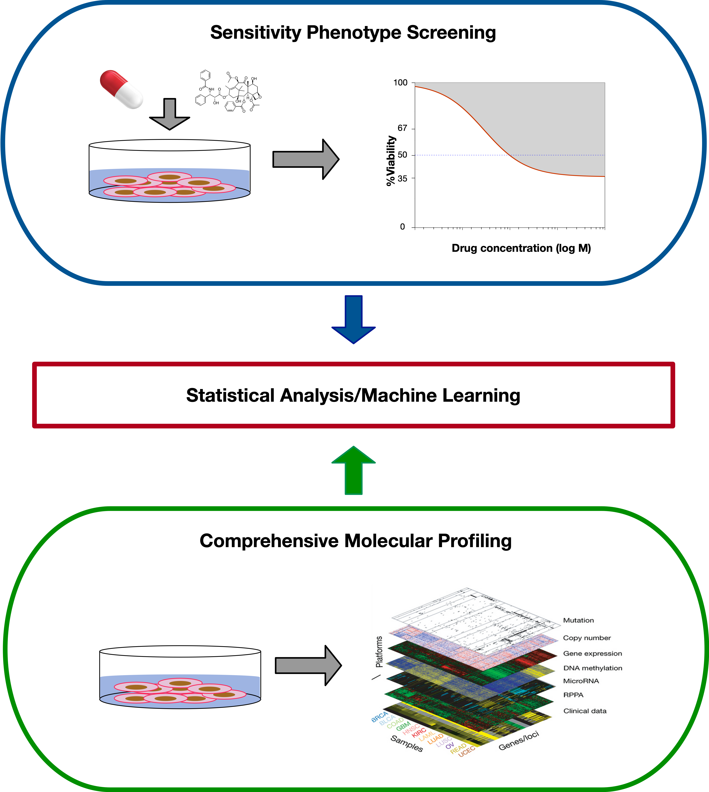
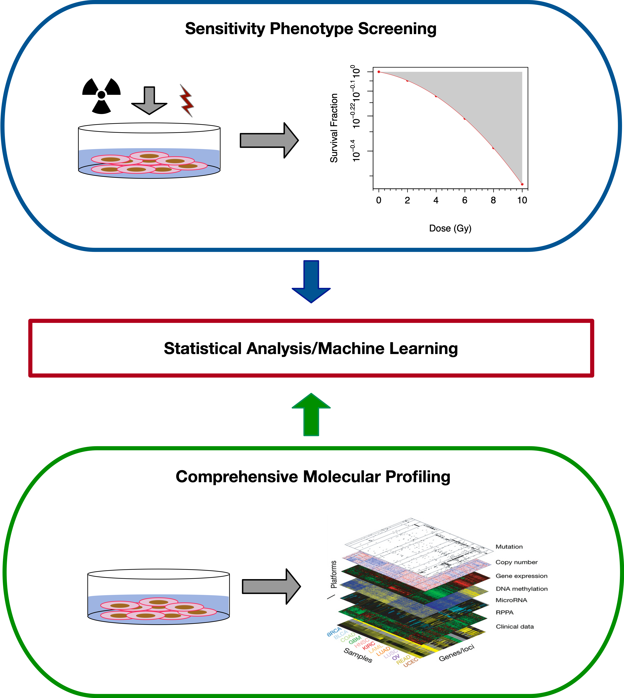
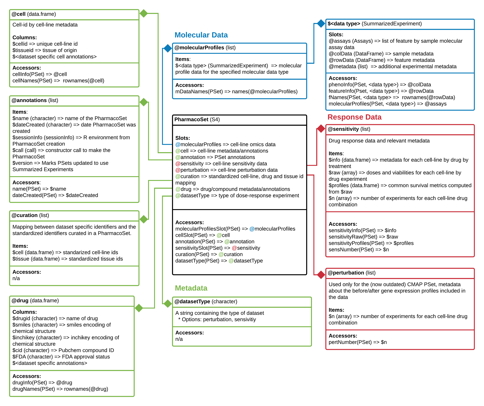
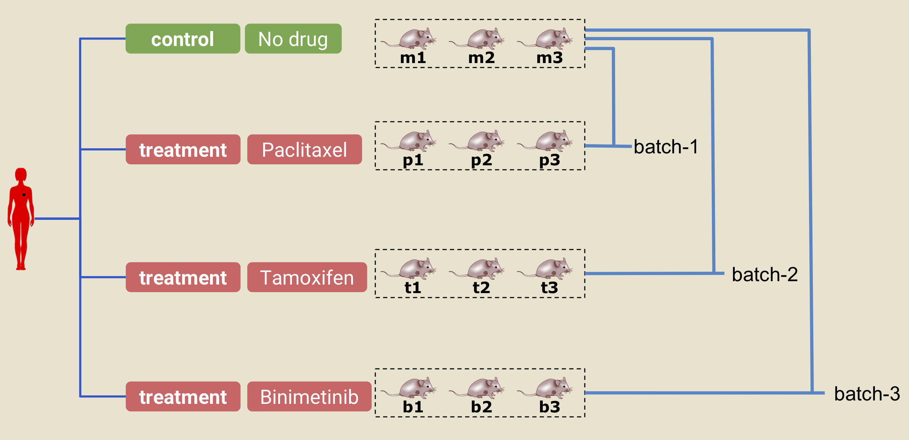

<!-- Remove {-} from header to show numbering -->
# Workshop Overview {-}

## Instructor(s) name(s) and contact information  {-}

* Petr Smirnov <petr.smirnov@uhnresearch.ca>
* Arvind Mer <arvind.mer@uhnresearch.ca>
* Christopher Eeles <christopher.eeles@uhnresearch.ca>


## Workshop Description  {-}

This workshop will focus on the synergies between analysis results from the PharmacoGx, Xeva and RadioGx packages and their usefulness for discovery of biomarkers of drug and/or radiation sensitivity in cancer cell lines (CCLs) and patent derived xenograft models (PDXs). We will discuss issues with data curation, consistency and reproducibility within the literature as well as illustrate the importance of unified analytical platforms, data and code sharing in bioinformatics and biomedical research. In this lab learners will be led through an analysis for each of the three packages on data provided by the download functions within them. The results of these analyses will then be explored to highlight how drug and radiation dose-response profiles in CCLs and PDXs can be used to discover potential synergistic biomarkers for drug-radiation and drug combination therapies. The resulting biomarkers will be discussed in the context of translational cancer research and clinical applications of genomic data. We will conclude with a discussion of how these biomarkers can be used to inform future in vitro and in vivo treatment screenings and ultimately provide useful insights for clinical trial design. 

### Pre-requisites  {-}


* Basic knowledge of R syntax
* Knowledge of or interest in pharmacogenomics and radio-genomics
* Familiarity with base bioconductor objects, including the SummarizedExperiment Class
* Familiarity with linear modelling in R; ANOVA, and goodness of fit tests

Useful publications: 

*  Smirnov, P. et al. PharmacoGx: An R package for analysis of large pharmacogenomic datasets. Bioinformatics 32, 1244–1246 (2016).
* Manem, V. SK. et al. Modeling Cellular Response in Large-Scale Radiogenomic Databases to Advance Precision Radiotherapy. Cancer Research (2019) doi:10.1158/0008-5472.CAN-19-0179.
* Mer, A. S. et al. Integrative pharmacogenomics analysis of patient-derived xenografts. Cancer Res canres.0349.2019 (2019) doi:10.1158/0008-5472.CAN-19-0349.


### Workshop Participation  {-}

Participants are expected to have the following required packages installed on their machines to be able to run the commands along with the instructors:
PharmacoGx,  Xeva, RadioGx, CoreGx and Biobase from Bioconductor.
The workshop will be presented as a set of analysis steps to be replicated by the learners, with instructors available to explain the why and how of applying these functions to the given datasets. 

### _R_ / _Bioconductor_ packages used  {-}

Bioconductor:

* https://bioconductor.org/packages/release/bioc/html/PharmacoGx.html
* http://bioconductor.org/packages/release/bioc/html/Xeva.html 
* https://bioconductor.org/packages/3.12/bioc/html/RadioGx.html
* https://bioconductor.org/packages/3.12/bioc/html/CoreGx.html

## Time outline  {-}

For a 1-hr workshop:

| Activity                                    | Time |
|---------------------------------------------|------|
| Introduction and Experimental Design                     | 5m |
| Data Structure and Common Functions Between Packages     | 5m |
| Examining and Extracting data of interest                     | 5m |
| Visualizing and modelling Sensitivity Data                     | 14m |
| Summary Functions                     | 3m |
| Signature Generation and Biomarker Discovery                   | 5m |
| Integrative Analysis Across Packages and Disciplines - 20 Minutes - Interactive Portion | 20m | 


## Workshop goals and objectives {-}

### Learning goals  {-}

* Describe pharmacogenomic and radiogenomic datasets and their usefulness in cancer research
* Learn how to extract information from these datasets and to intersect them over their common measured features, experiments and model systems
* Learn how to visualize experimental results from these datasets 
* Learn how to model dose-response for both small compound and radiotherapy datasets
* Learn measures to quantify the response in both cell line and PDX sensitivity screens, for both drug and radiation treatments
* Understand the differences in experimental design between radiotherapy and small compound treatments in cell lines
* Understand the differences in measuring response to therapy between cell line and PDX based models
* Understand how to identify potential genomic signatures of drug and radiation response and explore how synergies between these signatures can inform clinical trial design

### Learning objectives {-}

* List and download available standardized pharmacogenomic and radiogenomic datasets
* Access the molecular features, dose-response and metadata contained within the data structures defined in the packages
* Create drug-dose and radiation-dose response plots for cell line experiments
* Create tumor growth curve plots for PDX experiments
* Fit linear-quadratic models to radiotherapy experiments in cell lines
* Fit Hill Slope models to dose-response experiments using small compound treatments in cell lines
* Calculate the AAC, AUC, IC50, SF2, D10 metrics for response quantification in cell lines
* Calculate the mRECIST and other tumour growth curve summary metrics
* Visualize response of PDX experiments using an Oncoprint heatmap
* Predict in vivo and in vitro univariate biomarkers using the PharmacoGx, Xeva and RadioGx packages
* Compare signatures of response between chemotherapy compounds and radiotherapy
* Compare univariate biomarkers between cell line and PDX experiments


```{r setup, include=FALSE}
knitr::opts_chunk$set(echo = TRUE)
library(CoreGx)
library(PharmacoGx)
library(RadioGx)
library(gxbioc2020workshop)
```

# Introduction
This tutorial, titled Biomarker Discovery from High Throughput Screening
Datasets, focuses on a suite of packages designed to simplify analyses
correlating measures of treatment response measured on model systems with
molecular profiles of those systems. These packages primarly focus on modeling
response to cancer treatments in cancer models, but the concepts presented can
be applied to other disease types, given availability of data for the area of
interest. 

The first two packages, `r BiocStyle::Biocpkg("PharmacoGx")` and `r BiocStyle::Biocpkg("RadioGx")` focus on screens done  using cell lines as a
model system. PharmacoGx focuses on modeling and predicting the response of cell
lines treated with small  molecule therapies. RadioGx swaps the small molecule
treatment for irradiation of cell lines. The third package,  `r BiocStyle::Biocpkg("Xeva")`, looks at treatment response for __in vivo__ systems,
primarily Patient Derived Xenographs of cancer tumours growing in immune
compromised mice. 


## Data Structure and Common Functions Between Packages

While the experiments analyzed by the three packages are different, the workflow
that these packages accommodate are quite similar. First and
foremost, all three packages were developed to provide data structures that
package together screening and molecular data, as well as all related metadata,
for complete studies. These packages also provide an interface to download
large, publically available datasets which have standardized naming conventions,
so that data across different studies is immediately comparable. 

Furthermore, the analysis workflows share common tasks across the three domains
covered by these packages. This includes understanding and visualizing the data
that is present in each dataset; modeling the response of the model systems to 
treatment; summarizing that response into a measure comparable across models;
extracting and summarizing measurements of molecular features; and ultimately
correlating the response of model systems to their molecular state.

In this tutorial, we will be highlighting each analysis step across all three 
packages, and then finish with a demonstration of how to integrate across
the different domains presented here. 

# Experimental Designs

RadioGx and PharmacoGx are both used to analyze data from _in vitro_, cell based assays.
In cancer, the most common _in vitro_ model used is the cancer cell line. These cell lines
are usually obtained from patient tumour biopsies, which are passaged in a dish and often
treated with factors to immortalize the cells - that is, to grant them infinite 
proliferation capacity. Such models are often deposited in repositories such as the 
ATCC, and made available for purchase to researchers who wish to use them in their experiments. 


## _in vitro_ Pharmacogenomics

When studying Pharmacogenomics _in vitro_, the design of the experiment usually involves doing two things in parallel:
Each cell line in the study is profiled on a molecular level, which can include measuring DNA level
aberations such as SNVs and copy number changes, RNA expression levels, DNA methylation, and 
protein expression. In parallel, the cell lines undergo a viability based drug screen, where 
cell lines are treated with a panel of drugs, over a range of concentrations, and the growth 
of each cell line is compared to an untreated control. 

The variable response to drug treatement across different cell lines is then compared with 
the molecular states of the cells, using machine learning or statistical approaches to 
discern which molecular features are predictive of the observed drug response.  




## Radiogenomics

Radiogenomics follows a very similar design to Pharmacogenomics. The main difference is the 
form of the treatment applied to cells - in Pharmacogenomics, small molecule treatments are
studied, while in radiogenomics, the treatement is irradiation of the cells. While the design
of the study is similar, the difference in treatement causes differences in how the response of
cells is modelled and quantified, as we detail below. 

Currently, there is only one major, high-throughput dataset looking at __in vitro__ radiogenomics,
the Cleveland Clinic dataset. In this dataset, gamma radiation was used as the treatment. 
Conceptually however, there is no reason why alpha and beta radiation could not be studied in 
a similar experimental setup. 



## _In vivo_ Pharmacogenomics


_In vivo_ models play an important role in cancer drug discovery.
Patent derived xenografts (PDXs) are commonly used _in vivo_ models in cancer research.
They have several advantages over cell lines:

* PDXs are known to recapitulate tumor biology very well
* PDXs maintain the cellular and histological structure of the source tumor
* PDXs also keep tumor micro-enviroment and stromal elements
* Genomic properties of the tumor are largely preserved from patient to PDX
* Drug response of PDXs closely match the corresponding patient and clinical outcome

To create PDXs, cancerous tissues or cells from patients' tumors are engrafted into immunodeficient mice (either subcutaneous or orthotopic engraftment).
Once established, tumors from the PDXs can be passed from mouse to mouse, this is called passaging. For drug testing, PDXs are given a set drug dose at a set schedule (for example weekly). Change in tumor size is measured, usually physically using calipers.


# Data Storage and Access

## PharmacoGx

PharmacoGx stores drug screening data together with molecular profiling of 
cell lines in an object called a `PharmacoSet`, or `PSet` for short. This object
inherits for the `CoreSet` class defined in our package `CoreGx`, which abstracts
the common functionality across our similar packages. 
The basic structure of a PharmacoSet is as follows:

```{r pharmacoset, echo=FALSE, fig.wide=TRUE, fig.cap = "**PharmacoSet class diagram**. Objects comprising a `PharmacoSet` are enclosed in boxes. The first box indicates the type and name of each object. The second box indicates the structure of an object or class. The third box shows accessor methods from `PharmacoGx` for that specific object. '=>' represents return and specifies what is returned from that item or method."}

```

### Downloading PharmacoSet objects
Let us download the PSets used for this tutorial into our local working environment. 
A table of available PharmacoSet objects can be obtained by using the *availablePSets*
function. 
```{r avail_psets, eval=TRUE}
  library(PharmacoGx)
  availablePSets()
```

If you look through the table produced by availablePSets, you will notice that 
each PSet object is downloaded from Zenodo - an Open Science project supported by
the European Commision and CERN. Each PSet is assigned a DOI, which can be used
to uniquely identify the data used in your analysis and retrieve it in the future 
for research reproducibility.  

Any of the PharmacoSets in the table can then be downloaded by calling
`downloadPSet`, which saves the datasets into a directory of the users choice,
and returns the data into the R session. Lets try downloading the GDSC and CCLE
PSets. The following code is included as an example, but not run, as the objects
were preloaded onto the VM for the workshop. 
```{r download_psets, eval=FALSE}
  GDSC <- downloadPSet("GDSC_2020(v1-8.2)", saveDir=file.path(".", "PSets"))
  CCLE <- downloadPSet("CCLE_2015", saveDir=file.path(".", "PSets"))
```

To load the datasets used in this workshop, we run the following code:
```{r load_psets, eval=TRUE}
data(GDSC)
data(CCLE)
```

We can print out summary information about these datasets to the console,
simply by evaluating them on the command line. 

```{r print_out_psets, eval=TRUE}
CCLE
```

## RadioGx

The RadioSet has a structure similar to the `PharmacoSet` and also inherits
from the CoreSet^[exported by `r BiocStyle::Biocpkg('CoreGx')`] class . The radiation
slot is implemented in `r BiocStyle::Biocpkg('RadioGx')`  to hold relevant metadata
about the type(s) of radiation used in the dose-response experiment,
and is analogous to the drug slot in a `PharmacoSet`. The remainder of the slots
mirror the `PharmacoSet`.

```{r radioset, echo=FALSE, fig.wide=TRUE, fig.cap = "**RadioSet class diagram**. Objects comprising a `RadioSet` are enclosed in boxes. The first cell indicates the type and name of each object. Second cell indicates the structure of an object or class. Third cell shows accessor methods from `RadioGx` for that specific object. `=>` represents return and specifies what is returned from that item or method."}
knitr::include_graphics('./RadioGxClassDiagram.png')
```

### Downloading an RSet

`r BiocStyle::Biocpkg('RadioGx')` provides an interface similar to `r BiocStyle::Biocpkg("PharmacoGx")`
and `r BiocStyle::Biocpkg('Xeva')` for downloading our curated versions of published datasets.

To get a list of available `RadioSet`s, use:

```{r available_rsets, message=FALSE}
RSets <- availableRSets()
```

```{r available_radiosets_table, echo=FALSE, results="asis"}
knitr::kable(RSets[, c("RadioSet_name", "Date_updated", "DOI")])
```

As the `r BiocStyle::Biocpkg('RadioGx')` package was only recently released, there is
currently only one dataset available. Let's download the 'Cleveland' RSet, which contains
a highly curated version of the data from Yang *et al.*, 2016.

For this workshop, we have subset this dataset. The entire dataset can be downloaded using the following:

```{r download_rset, eval=FALSE}
Cleveland <- downloadRSet('Cleveland', saveDir='data')
```

Let's load the RSet for this workshop.

```{r printing_a_radioset, hide=TRUE}
data(Cleveland)
Cleveland
```

Similar to PharmacoGx and Xeva, a summary of the contents of the RadioSet is printed
when calling a RadioSet in the console. We can see that the Cleveland RSet contains
sensitivity information for 303 cell-lines treated with a single type of radiation.
The RSet also contains rna^[microarray], rna-seq and cnv molecular data for a subset of available
cell-lines.


## Xeva
The R package `Xeva` connects the tumor volume vs. time data with genomics data in an R class called `XevaSet`.  This allows users to analyze the data and perform biomarker discovery.

In a Xeva object, the `experiment` slot stores the data for each individual PDX/mouse. With the exception of tumor growth data (time vs. tumor volume), for each individual PDX/mouse, you can access metadata such as the patient's age, sex, tissue histology, and passage information.
All of this metadata is stored in the `pdxModel` class, where a unique ID called `model.id` is given to each PDX/mouse model. As for the tumor growth information, Xeva provides separate functions for retrieving and visualizing time vs. tumor volume data.
We will see later how to get these data for an individual `model.id`, but first, let's define some other terms that appear in the Xeva package.

A PDX experiment can be one of the two categories:

- *treatment* represents experiments in which the PDX receives some kind of drug (or drug combination)
- *control* represents experiments in which the PDX receives no drug


To see the effect of a drug, several replicate experiments are done for both the control and the treatment categories.
In Xeva, a collection of PDX `model.ids` originating from the same patient is organized in batches (`batch`). A `batch` has two arms: `control` and `treatment`. This is illustrated in the figure below:

```{r xevastructure, echo=FALSE, fig.wide=TRUE, fig.cap = "A PDX experiment. The text under each of the PDX/mouse (ie. m1, m2, p1, etc.) denotes the `model.id` in Xeva. In this example, three PDXs are delclared as control (m1, m2, and m3). Similarly, in the treatment arm, 3 PDXs are given the drug paclitaxel (p1, p2, and p3), 3 are given tamoxifen (t1, t2, and t3), and 3 are given binimetinib (b1, b2, b3). The PDXs in the control arm and one of the treatment arms together constitute a batch. For example, control arm models (m1, m2, and m3) and treatment arm models (t1,t2, and t3) together create a batch called batch-2."}

```


### Downloading Xevaset objects
Several `XevaSet` objects can be obtained by using the *downloadXevaSet*
function.
```{r X1, eval=TRUE}
  library(Xeva)
  Xeva::downloadXevaSet()
```
The following chunk loads the dataset used in the tutorial and prints out its summary:

```{r X2_1, eval=TRUE}
data(brca_full)
brca <- brca_full
```
# Examining and Extracting data of interest

There are many common functions between the datasets for extracting the data
relevant to your analysis. PharmacoGx are RadioGx are the most similar, due
to the large similarities in their experimental designs. 
For most of your work with the objects, we recommend you use the accessor
functions implemented in the packages to access the data. 
These accessors are largely stable across versions, while the implementation in 
the background can change as datasets grow in size and complexity. 


This section is meant both as an introduction, and as a reference to the most used 
accessors for each package. 

## CoreGx accessors

PharmacoGx and RadioGx share a lot of similarities in their object structure. 
As such, a shared interface is available to access much of the data in these objects.


In general, the PSet and RSet store three major categories of data: 
metadata/annotations, molecular data and treatment response data.
These are demarcated in **Fig.** \@ref(fig:pharmacoset) and **Fig.** \@ref(fig:radioset) using green, blue and red, respectively. Accessor methods are available
to retrieve all three kinds of data from a CoreSet; the accessor methods for each component are listed
in the bottom most cell of each object in the class diagrams. We will discuss a subset of these methods
now.

### Accessing metadata

There are two major metadata slots in the `CoreSet` which are commonly useful for your analysis. 
The first is common between all the packages, the `cell` slot. This slot contains 
information about the cell lines which were profiled in the dataset. This information exists 
for all cell lines, if they exist in any of the molecular or sensitivity data included in the 
objects. Note that not all cell lines are profiled in all assays, which is one of the sources
of complexity when analyzing data from large studies. 

To access the cell line metadata, you can use the following accessors:

```{r cell_slot_accessors, results="asis", align="left"}
knitr::kable(cellInfo(CCLE)[1:3,1:3])
knitr::kable(cellInfo(Cleveland)[1:3,1:3])
```

The standardized identifiers for those cell lines across our packages are 
the row names of this object. For convenience, they are accessible through
the `cellNames` function:

```{r cellnames_accessor}
head(cellNames(CCLE))
```

For example, here we can use the `cellInfo` function to pull out the tissue of
origin for each cell line in the CCLE dataset. The `tissueid` column is standard
for PSets, and should be present in all objects.

```{r piechart, fig.cap="Tissue of origin of cell lines in CCLE study"}
mycol <- c("#8dd3c7","#ffffb3","#bebada","#fb8072","#80b1d3","#fdb462",
           "#b3de69","#fccde5","#d9d9d9","#bc80bd","#ccebc5","#ffed6f",
           "#a6cee3","#1f78b4","#b2df8a","#33a02c","#fb9a99","#e31a1c",
           "#fdbf6f","#ff7f00","#cab2d6","#6a3d9a","#ffff99","#b15928")
pie(table(cellInfo(CCLE)[,"tissueid"]), 
    col=mycol, 
    main="Tissue types", 
    radius=1, 
    cex=0.8)
```

The other important metadata slot will vary across the two packages, being called 
`drug` in PharmacoGx, and `radiation` in RadioGx. They are discussed below.

The `CoreSet` also includes `annotations`, which keep track of metadata about
the creation of the `CoreSet` object itself, and `curation`, which keeps track of the 
remapping of identifiers from those used in the original study to those in the object. 


### Accessing molecular data

Molecular data are contained in the `molecularProfiles` slot.

```{r molecular_data_slot_accessors}
# Get the list (equivalent to @molecularProfiles, except that it is robust to changes in CoreSet structure
## PSet
str(molecularProfilesSlot(CCLE), max.level=2)
## RSet
str(molecularProfilesSlot(Cleveland), max.level=2)

# Get the names from the list
mDataNames(CCLE)
mDataNames(Cleveland)
```

All molecular data in any class inheriting from CoreSet is contained in a `SummarizedExperiment`
object. While `r BiocStyle::Biocpkg('SummarizedExperiment')` comes with it's own set of accessors, we recommend using
available `RadioGx` and `PharmacoGx` accessor methods as it allows your scripts to be robust to future changes
in the structure of a `CoreSet` object. Below, we demonstrate each method with an RSet, but encourage you to 
try them on the PSets as well. They should all work!

```{r sample_meta_data}
# Get sample metadata
phenoInf <- phenoInfo(Cleveland, 'cnv')
```

To keep the document formatted nicely, the following tables have been subset to the first three rows and columns.

```{r print_sample_meta_data, echo=FALSE, fig.small=TRUE, results="asis"}
knitr::kable(phenoInf[1:3, 1:3], row.names=FALSE)
```

```{r feature_meta_data}
# Get feature metadata
featInfo <- featureInfo(Cleveland, 'rna')
```

```{r print_feature_meta_data, echo=FALSE, align="center", results="asis"}
knitr::kable(featInfo[1:3, 1:3], row.names=FALSE)
```

```{r molecular_data, fig.wide=TRUE}
# Access the molecular feature data
mProf <- molecularProfiles(Cleveland, 'rnaseq')
```

```{r print_molecular_profile_data, echo=FALSE, results="asis"}
knitr::kable(mProf[1:3, 1:3])
```

### Accessing response data

Data for treatment response can also be accessed the same way across `PharmacoGx` and `RadioGx`.
The difference between the two packages is in the data itself, and the models applied to the data, discussed 
below. Here is a quick summary of accessor functions for response data.

```{r response_slot_accessor}
# Get sensitivity slot
sens <- sensitivitySlot(CCLE)
```

```{r response_slot_accessor_example}
names(sens)
```

```{r raw_response_data_accessor}
# Get sensitivity raw data
sensRaw <- sensitivityRaw(CCLE)
```

```{r raw_response_data_accessor_example, results="asis"}
# Get sensitivity raw data
knitr::kable(sensRaw[,,2][1:3, 1:3])
```


```{r response_profile_accessor}
# Get sensitivity profiles
sensProf <- sensitivityProfiles(CCLE)
```

```{r response_profile_accessor_example, results="asis"}
knitr::kable(sensProf[1:3, 1:3])
```


```{r response_info_accessor}
# Get sensitivity info
sensInfo <- sensitivityInfo(CCLE)
```

```{r response_info_accessor_example, results="asis"}
knitr::kable(sensInfo[1:3, 1:3])
```


## PharmacoGx Drug Metadata

In PharmacoGx, metadata about the compounds used can be accessed through the `drugInfo` accessor.
This works very similar to the `cellInfo` function. 
```{r drug_slot_accessors, results="asis", align="left"}
knitr::kable(drugInfo(CCLE)[1:3,1:3])
```

Drug names are also accessed as one would expect:

```{r drug_names}
drugNames(CCLE)
```

## Radiation Metadata

A unique slot to RadioGx, `radiation` has additional
accessor methods to retrieve the radiation types used in a given sensitivity experiment.

```{r radiation_info_accessor}
# Get the radiation info data.frame from an RSet
radInf <- radiationInfo(Cleveland)
```

```{r print_radinf, fig.wide = TRUE, results="asis"}
knitr::kable(radInf)
```

Currently, only one type of radiation has been used in an `RSet`. However, we hope to add new `RSet`s covering a wider range of radiation
sensitivity and perturbation experiments in the near future. The following method is also available to retrieve the radiation
types as a `character` vector instead of a `data.frame`.

```{r radiation_types_accessor}
radTypes <- radiationTypes(Cleveland)
radTypes
```


## Subsetting PharmacoSets


PSets can be subsetted by referring directly to the drugs and cell lines you want
to keep in the dataset. For example, we can subset the GDSC PSet in the following 
ways:

```{r subsets, eval=TRUE}
print(GDSC)
print(drugNames(GDSC)[1])
print(subsetTo(GDSC, drugs="Paclitaxel"))
print(GDSC["YT","Paclitaxel"])

```

As an exercise, lets manually compute the number of overlapping cell lines between CCLE and GDSC. Try it yourself!

If you noticed as you completed the previous exercise, cell line and drug names 
are standardized between PSets downloaded using the *downloadPSet* function. 
This is the major benefit in working with the pre-curated objects: entities
follow a standardized naming scheme, which was chosen to be human readable 
whenever possible. 

PharmacoGx also implements a convenience function to intersect PSets:

```{r intersect, echo=TRUE, eval=FALSE}
common <- intersectPSet(list(CCLE, GDSC), intersectOn=c("cell.lines"))
print(common)

```

## Xeva


The structure of Xeva is different from the CoreSet structure. As such, many of the accessor functions
are also different.

As mentioned earlier, Xeva stores metadata for each individual PDX model.
We can retrieve the meta-information about each PDX, such as number of models and tissue type, using:
```{r X_modelInfo}
brca.mod <- modelInfo(brca)
dim(brca.mod)
brca.mod[1:4, ]
```

The output shows that the `brca` dataset contains `r nrow(brca.mod)` PDX models.
We can also see the time vs. tumor volume data for a model using:

```{r X_getEx}
model.data <- getExperiment(brca, model.id = "X.1004.BG98")
head(model.data)
```

Similarly, for `batch` names, we can obtain all predefined batch names using:

```{r X_batchInfo}
batch.name <- batchInfo(brca)
batch.name[1:4]
```

The information about a \textbf{batch} can be shown using:
```{r X_batchInfo2}
batchInfo(brca, batch = "X-1004.binimetinib")
```
Here, for the batch named `X-1004.binimetinib`, we can see that the control sample is `X.1004.uned` and the treatment sample is `X.1004.biib`.


# Visualizing and modeling sensitivity data

## Working with Dose Response data from PSets

### Plotting Drug Dose Response Data

Drug-Dose response data included in the PharmacoSet objects can be conveniently
plotted using the `drugDoseResponseCurve` function. Given a list of
PharmacoSets, a drug name and a cell name, it will plot the drug dose response
curves for the given cell-drug combination in each dataset, allowing direct
comparisons of data between datasets.

```{r curves, fig.align='left'}
cells <- c("SK-MEL-2","697","NCI-H1666")
# par(mfrow=c(1, 3), pty = "s")
drugDoseResponseCurve(drug="Lapatinib", cellline=cells[1], 
                      pSets=list(CCLE, GDSC), plot.type="Actual", 
                      legends.label="aac_published")
drugDoseResponseCurve(drug="Lapatinib", cellline=cells[2], 
                      pSets=list(CCLE, GDSC), plot.type="Actual", 
                      legends.label="aac_published")
drugDoseResponseCurve(drug="Lapatinib", cellline=cells[3], 
                      pSets=list(CCLE, GDSC), plot.type="Actual", 
                      legends.label="aac_published")
```

The function `drugDoseResponseCurve` can also be used to plot your own drug dose response curves, as follows:

```{r ddrc_own}
concentrations <- 1/2^seq(0,8) * 1
viabilities <-  c(0, 33.3, 60, 77.8, 88.2, 93.9, 96.9, 98.4, 99.2)

drugDoseResponseCurve(concentrations = list("Exp 1" = concentrations), viabilities = list("Exp 1" = viabilities))
```


### Fitting Drug Dose Response Curves

One of the core tasks implemented in PharmacoGx is the fitting of Hill Curve
Models to dose-response data. In PharmacoGx, we use the 3 Parameter Hill Curve
function as our model of drug response in cancer cell lines:

$$y = E_\infty + \frac{1-E_\infty}{1 + (\frac{x}{EC50})^{HS}}$$
This is a log-logistic model, meaning that it takes the form of a logistic curve when x is on the log scale. 
The three parameters are:
$E_\infty$, which is the maximal inhibition predicted at infinite concentration of the drug (the right asymptote);
$EC50$, which is the inflection point of the logit, where the inhibition reaches 50% of the maximum;
$HS$, the Hill Slope, which is a measure of the cooperativity of binding. This parameter controls the steepness 
of the logit, and is interpreted based on its relation to 1. Values larger than 1 imply positive cooperativity in 
inhibition/binding of the target for the small molecule ligands, which values less than 1 imply negative cooperativity/antagonism.

```{r hillSlopeFig, fig.cap="Diagram of a logLogistic Hill Slope", echo=FALSE}
knitr::include_graphics("./hill_slope.png")
```


To fit a Hill Slope model to your data in PharmacoGx, you can use the `logLogisticRegression`
function, as below:

```{r loglogistic}
concentrations <- 1/2^seq(0,8) * 1
viabilities <-  c(0, 33.3, 60, 77.8, 88.2, 93.9, 96.9, 98.4, 99.2)

pars <- logLogisticRegression(conc = concentrations, viability = viabilities)
print(pars)
```

For all the data in PSets, this modeling has been precomputed and stored in the object, 
under `sensitivityProfiles`:

```{r log_logistic_precomputed, results="asis"}
knitr::kable(sensitivityProfiles(CCLE)[1:5,c("E_inf", "EC50", "HS")])
```


### Computing Summary Measures for DDRCs

Often with _in vitro_ Pharmacogenomics data, we want to compare the drug sensitivity of a cell line 
to some omic feature. For this, we want to summarize the drug dose response curve into a single 
number representing the sensitivity of the cell line. 

```{r hillSlopeSumFig, fig.cap="Some commonly used summary metrics for a dose-response curve", echo=FALSE}
knitr::include_graphics("./hillSlopeSummary.png")
```


The IC50 and Area Above the Curve are two
convenient metrics for quantifying the observed drug sensitivity. If you noticed above, 
the `drugDoseResponseCurve` function computes them by default. In PharmacoGx, they can be 
computed manually as follows:

```{r sens_own}
concentrations <- rev(1/2^seq(0,8) * 1)
viabilities <-  c(99.2, 98.4, 96.9, 93.9, 88.2, 77.8, 60, 33.3, 0)

print(PharmacoGx::computeAUC(concentration = concentrations, viability = viabilities))
print(PharmacoGx::computeIC50(concentration = concentrations, viability = viabilities))
```

In PharmacoGx, we call these measures 'sensitivity measures'. PSets come with
these measures precomputed, and accessible using the `sensitivityProfiles`
function:

```{r sensProf, results="asis", size="small"}
knitr::kable(head(sensitivityProfiles(CCLE)[,1:5]))
```

## RadioGx


### Fitting Linear Quadratic (LQ) Models

RadioGx provides a number of functions for analyzing dose response experiments.
To use these functions, we must first fit a statistical model to the dose
response data. Due to the nature of radiation treatment, the model used is 
different from the model in Pharmacogenomics. While Pharmacogenomics uses
a log-logistic Hill Curve for modeling the dose-response relationship, 
Radiogenomics analysis traditionally uses a Linear Quadratic model. This is due
to the different action of radiation treatment compared to compound inhibition of
targets. 

$$SF = e^{-\alpha D * \beta D^2} $$

This package exports a function for fitting linear-quadratic
models to dose response data. The function can be used with data contained in
a RadioSet or with raw dose-response data.

```{r model_fit}
# Extract raw sensitvity data from the RadioSet
sensRaw <- sensitivityRaw(Cleveland)
```

```{r structure_sensitivity_raw}
str(sensRaw)
```

The data returned by `sensitivityRaw(RSet)` is a three dimensional
array, but it can also be thought of as a set of experiment by treatment
matrices. We can see by the `dimnames` of the third dimensions that
the first matrix holds the radiation dose (in Gy) for each experiment,
while the second matrix holds the viability measurements for the cell-line
after each dose in the experimental series.

```{r cellline_names}
# Find a cancer cell-line of interest
head(sensitivityInfo(Cleveland)$cellid)
```

```{r selecting_cancer_cell_line}
cancerCellLine <- sensitivityInfo(Cleveland)$cellid[1]
print(cancerCellLine)
```

```{r extracting_dose_response_data}
# Get the radiation doses and associated survival data from the Cleveland RSet
radiationDoses <- sensRaw[1, , 'Dose']
survivalFractions <- sensRaw[1, , 'Viability']
```

```{r fitting_lq_model}
LQmodel <- linearQuadraticModel(D=radiationDoses,
                                SF=survivalFractions)
LQmodel
```

Above we see that LQmodel contains the alpha and beta coefficients for the dose
response curve fit to the dose and viability data for the `r sensitivityInfo(Cleveland)$cellid[1]` cancer cell-line.
Based on the $R^2$ attribute we can see that the model fit for this data is
good, with `r round(attributes(LQmodel)$Rsquare,3 ) * 100`% of observed variance
explained by the model.

### Calculating Dose-Response Metrics

RadioGx provides a number of functions for calculating common dose response
metrics such as surviving fraction (SF), area under the curve (AUC) and dose at
which only 10% of cancer cells survive (D10).

Some of these functions require the alpha and beta coefficients, as calculated
above using the `linearQuadraticModel` function.

```{r metrics_computed_from_fit_parameters}
survFracAfter2Units <- computeSF2(pars=LQmodel)
print(survFracAfter2Units)

dose10PercentSurv <- computeD10(pars=LQmodel)
print(dose10PercentSurv)
```
We see from the above code cell that after two units of radiation,
`r round(100 * survFracAfter2Units, 3)`% of cancer cells remain relative to the initial population.
Conversely, using `computeD10` we see that on average `r round(dose10PercentSurv, 3)` units of radiation
need to be administered to result in 10% cell-line survival (i.e., 90% of cancer cells
are killed).

Other dose-response metrics can be computed directly using radiation dose
and cancer cell viability data.

```{r metrics_computed_from_dose_response_data}
areaUnderDoseRespCurve <- computeAUC(D=radiationDoses, pars=LQmodel, lower=0,
                                     upper=1)
print(areaUnderDoseRespCurve)
```

In the above code block we compute the AUC for a dose-response curve between a
dose of 0 to 1 Gy.

### Dose-Response Curves

The `doseResponseCurve` function can be used to generate plots of surviving
fraction vs dose for radiation sensitivity experiments. In this example
we provide raw data values to create the plot. When the `plot.type` is set to
"Both", a linear-quadratic model will also be fit to the supplied dose-response
values.

```{r plotting_rad_dose_resp, fig.small=TRUE}
doseResponseCurve(
  Ds=list("Experiment 1" = c(0, 2, 4, 6)),
  SFs=list("Experiment 1" = c(1,.6,.4,.2)),
  plot.type="Both"
)
```

Additionally, `doseResponseCurve` can be used to create dose response curves
directly from a curated RadioSet object. When utilizing this feature, a
cell-line must be selected from the RadioSet. This can be done by name
if you know which cell-line you are looking for. If you don't know which
cell-line you want to visualize, the available
cell-lines can be explored using the `cellInfo` function.

```{r plotting_rad_dose_resp_rSet, fig.small=TRUE}
doseResponseCurve(
  rSets=list(Cleveland),
  cellline=cellInfo(Cleveland)$cellid[3]
)
```

## Xeva

Drug response in PDX models is usually not assessed in the same way as _in vitro_. 
Rather than looking at viability vs dose curves, one looks at tumour growth vs
time curves, to see if the treatment with a drug can inhibit tumour growth or
initiate tumour shrinkage and clearance. Given the increased complexity of a tumour
growing within a living mouse, there is no canonical model that is fit to this data.
Rather, there are several options for assessing response in these models, each with 
its pros and cons.

### Visualizing Tumour Growth Curves
Xeva provides functions to visualize these PDX time vs. tumor volume curve.
```{r 1X3, eval=TRUE}
plotPDX(object = brca, patient.id = "X-1004", drug = "BGJ398")

plotPDX(object=brca,patient.id="X-1004",drug="BGJ398",control.name="untreated")
```

We can also plot the normalized volume.
```{r 1X4, eval=TRUE}
plotPDX(object=brca,patient.id="X-1004",drug="BGJ398",control.name="untreated",
        vol.normal = TRUE)
```

When replicates are available Xeva can be used the visualize each model.
```{r 1X5, eval=TRUE}
data("repdx")
plotPDX(object=repdx,patient.id="P1",drug="treatment",control.name="Control",
        vol.normal = TRUE)
```

### Quantifying PDX Drug Response

In Xeva several response computing functions such as mRECIST, slope, AUC etc. have been implemented. Drug response can be computed for PDX models as:

```{r 1X6, eval=TRUE}
response(brca, model.id="X.1004.BG98", res.measure="mRECIST")
```

Drug response for all models is stored in the sensitivity slot and can be extracted using
```{r 1X7, eval=TRUE}
brca.mr <- summarizeResponse(brca, response.measure = "mRECIST",
                             group.by="patient.id")
```

We can visualize this matrix as:
```{r 1X8, eval=TRUE}
plotmRECIST(brca.mr, control.name = "untreated")
```

# Summary Functions

## PharmacoGx

Pharmacogenomics studies often contain many examples of either replicated or
missing data. One of the most common tasks in preparing data for statistical or
machine learning analysis is aligning your features and labels. To accelerate
using Pharmacogenomics data for analysis, PharmacoGx contains two functions
which create deduplicated matrices with missing data filled by NAs:
`summarizeSensitivityProfiles` and `summarizeMolecularProfiles`. They create
matrices which are drugs x cell lines and molecular features x cell lines, with
any cell lines profiled for only sensitivity or molecular features padded with
NA values. For the molecular profiles, the data are returned in a `r BiocStyle::Biocpkg("SummarizedExperiment")` object, while drug sensitivity data are returned as a matrix.

```{r summary, results="hide", message=FALSE, error=FALSE, warning=FALSE}
mol.prof <- PharmacoGx::summarizeMolecularProfiles(CCLE, "rna")
sens.prof <- PharmacoGx::summarizeSensitivityProfiles(CCLE, "aac_recomputed")
```
```{r}
dim(mol.prof)
dim(sens.prof)
```


Below, we use the summarizeSensitivityProfiles function and ggplot to investigate the distributions of 
AUC values within CCLE.

```{r ccleaac, fig.cap="Cells response to drugs in CCLE"}
library(ggplot2, verbose=FALSE)
library(reshape2, verbose=FALSE)
CCLE.aac <- PharmacoGx::summarizeSensitivityProfiles(CCLE, sensitivity.measure = "aac_recomputed")
melted_data <- melt(CCLE.aac)
NA_rows <- unique(which(is.na(melted_data), arr.ind=T)[,1])
melted_data <- melted_data[-NA_rows,]
p <- ggplot(melted_data, aes(x=Var1,y=value)) +
  geom_boxplot(fill="gray") +
  theme(axis.text.x=element_text(angle=90,hjust=1)) +
  xlab("Drugs") +
  ylab("AAC")
print(p)
```
## RadioGx

### Summarizing Sensitivity

To retrieve a radiation type by cell-line summary of a sensitivity experiment, we use the `summarizeSensitivityProfiles` function.
This will return a `matrix` where rows are radiation type^[Note there is currently only one radiation type available, but in the future there will be more], columns are cell-line and values are viability measurements summarized
using `summary.stat`^[Available options are 'mean', 'median', 'first', 'last']. The sensitivity measure to summarize can be
specified using 
`sensitivity.measure`^[See `sensitivityMeasures(RSet)` for available options].

```{r summarize_sensitivity}
sensSummary <- RadioGx::summarizeSensitivityProfiles(Cleveland)
```

```{r show_summarized_sensivitiy}
sensSummary[, 1:3]
```

### Summarizing Molecular Data

```{r summarize_molecular_data}
mprofSummary <- RadioGx::summarizeMolecularProfiles(Cleveland, mDataType='rna', summary.stat='median', fill.missing=FALSE)
```

```{r show_summarized_sensitivity}
mprofSummary
```
Due to a lack of replicates in the Cleveland `RSet`, the returned `SummarizedExperiment` object contains the same information as
the original. For other experiments with replicates, however, the result should contain one column per unique cell-line id. For
ease of interoperability with the response data contained in an `RSet`, if `fill.missing` is `r TRUE` empty columns for the
cell-lines in the sensitivity experiment, but not in the molecular profile will be added to the `SummarizedExperiment` such
that the dimensions are equal.

## Xeva
### Summarizing Molecular Data

As already seen above, Xeva provides a method to extract drug response data from XevaSets. Like PharmacoGx and RadioGx,
the package also provides a method to extract the molecular data associated with a particular set of mice. For example, 
we can extract the RNAseq data for all the PDXs treated with trastuzumab, as below:

```{r xeva_summarize_mol, results="asis"}
brca_trastuz <- Xeva::summarizeMolecularProfiles(brca, mDataType="RNASeq", drug = "trastuzumab")
brca_trastuz
```


# Signature Generation and Biomarker Discovery

## Drug Sensitivity Signatures
Finally, we will talk about some functions built into PharmacoGx to generate signatures of molecular features which 
correlate with response to particular compounds. In PharmacoGx, the main function to generate signatures of response 
across drugs is `drugSensitivitySig`. It takes as input a PSet, and the molecular data type you wish to use to 
generate the signatures, and computes the linear association between each feature and each drug response vector independently. 
The default of using all features, drugs and cell lines in the dataset can be modified with parameters detailed below. 

At its core, drugSensitivitySig fits a nested linear model to the drug response data, using the molecular feature, as well as
cell tissue of origin and batch effect as possible predictors. The function then uses ANOVA to judge whether including the 
molecular feature in the model leads to a statistically significant improvement in prediction accuracy ($R^2$). For more
details on the implementation, we encourage readers to reference the PharmacoGx manuscript, or the vignettes included in the 
package. 

Here, as an example, we will run `drugSensitivitySig` to generate a signature of response to Lapatinib and Erlotinib, two
targetted therapies, from the GDSC data. We will do this with a random 10 genes measured in the 
expression matrix, as the full computation can take some time to complete.

```{r drugSensSigEx, eval=TRUE, echo=TRUE, results="hide", message=FALSE, error=FALSE, warning=FALSE, cache=TRUE}
## Extracting the first 100 gene names. featureInfo brings up the rowData of the "rna" SummarizedExperiment
chosen.genes <- sample(rownames(featureInfo(GDSC, "rna")), 10)

sigs <- PharmacoGx::drugSensitivitySig(GDSC, "rna", sensitivity.measure = "aac_recomputed", drugs=c("Erlotinib", "Lapatinib"), features = chosen.genes)
```
Lets look at the head of the signature for the two drugs:

```{r, results="asis"}
knitr::kable(x = head(sigs[,1,]))
```

```{r, results="asis"}
knitr::kable(x = head(as.data.frame(sigs[,2,])))
```

## Radiation Sensitivity Signatures

The true usefulness of the RadioGx package comes from the ability to determine gene signatures for a
cell-line from a sensitivity experiment. Cell-lines of interest to a given researcher can be selected
and a molecular signature computed which correlates specific molecular features with a given sensitivity profile.
Using this method one could identify signatures associated with either radio-sensitivity or radio-resistance.
Combining this signature with drug response gene signatures from `r BiocStyle::Biocpkg('PharmacoGx')`, as will
be done in the subsequent section, one can identify drugs which could augment the effectiveness of a
given radiation signature. Perhaps more powerfully, drugs which target features associated with radio-resistance
can be found, potentially synergistically increasing the overall effectiveness of the combined treatment. We must 
note however that this is an active area of research, and the examples provided are illustrative only. When conducting
research in this field, care must be taken in choosing the right model systems, measures of sensitivity, and 
incorporating prior knowledge to differentiate promising hits from experimental artifacts.

```{r compute_molecular_signature, cache=TRUE, eval=FALSE}
protein_coding <- which(featInfo$GeneBioType %in% "protein_coding")
radSensSig <- radSensitivitySig(Cleveland, mDataType='rna', nthread=1, features=fNames(Cleveland, 'rna')[protein_coding])
```

Because computing these signatures takes a significant amount of time, we use a precomputed version included with the 
workshop packages. 

```{r compute_molecular_signature_preload, cache=TRUE}
protein_coding <- which(featInfo$GeneBioType %in% "protein_coding")
data("radSensSig")
```

```{r ordering_molecular_signature_results}
# Convert to a data.frame
radSensSigDF <- data.frame(radSensSig@.Data[, , ], row.names=rownames(radSensSig))

# Order by estimated correlation
radSensSigDF <- radSensSigDF[order(radSensSigDF$estimate, decreasing=TRUE), ]

# Subset to only significant FDR
radSensSigDF <- radSensSigDF[radSensSigDF$fdr < 0.05, ]
```

```{r determine_gene_signature}
radSensGeneSig <- head(radSensSigDF, 10)
radResistGeneSig <- tail(radSensSigDF[radSensSigDF$fdr < 0.05, ], 10)
```

```{r sensitivity_molecular_sig, results="asis"}
knitr::kable(radSensGeneSig, caption="Top 10 Gene Markers of Radio-sensitivity in the Cleveland RSet")
```

```{r resistance_molecular_sig, results="asis"}
knitr::kable(radResistGeneSig, caption="Top 10 Gene Markers of Radio-resistance in the Cleveland RSet")
```

## _in vivo_ Biomarker Discovery

For _in vivo_ biomarker discovery we need the genomic data along with drug response. As discussed above, this can be extracted using the `summarizeMolecularProfiles` function. The output will be an `ExpressionSet` object which contains genomic data and drug response.

```{r X9, eval=TRUE}
suppressMessages(library(Biobase))
dr.mol = summarizeMolecularProfiles(brca, drug="BGJ398", mDataType="RNASeq",
                                    tissue= "BRCA",
                                    sensitivity.measure="best.average.response")
exprs(dr.mol)[1:5, 1:3]
pData(dr.mol)[1:5, c("model.id", "best.average.response")]
```
The output can be used for further inquiry  such as correlation analysis.

```{r X10, eval=TRUE, warning=FALSE}

genes <- rownames(exprs(dr.mol))

.computeCorTestDF <- function(g, dr.mol) {
  cr <- cor.test(exprs(dr.mol)[g, ], pData(dr.mol)$best.average.response)
  return(data.frame(gene=g, cor=cr$estimate, p=cr$p.value))
}

corDataFrames <- lapply(genes, .computeCorTestDF, dr.mol=dr.mol)
output <- do.call(rbind, corDataFrames)

head(output)
```


Below, we will use this functionality of Xeva to see if an association discovered _in vitro_ holds up in an _in vivo_ setting.

# Integrative Analysis across Packages and Disciplines

In this section, we will go through two short examples of analysis which integrates across the packages presented above,
highlighting the use of these packages to explore hypotheses across domains.  

## Comparing Sensitivity Signatures between Radiation and Drug Response

Both RadioGx and PharmacoGx allow you to compute signatures of how much each molecular feature correlates 
with response to treatment, in the _in vitro_ model systems. A natural question to ask is how the signature 
for response to gamma radiation will compare to signatures of response to various drugs. This can be used
to generate hypothesis for combination therapies, or to gain insight into mechanisms of action. 

We will run through the steps necessary to generate these results below, but note that the example datasets 
included with this workshop are incomplete (due to file size limits for github hosted R packages), and that 
due to time constraints the signatures we examine will have been precomputed from the full objects. We encourage
the reader to work through this example with the full dataset.

To start, we will load the packages, and the data we will be using.

```{r start_rgx_pgx, echo=TRUE, eval=FALSE}
library(PharmacoGx)
library(RadioGx)

GDSC1 <- downloadPSet("GDSC_2019(v1_8.0)")
Cleveland <- downloadRSet("Cleveland")
```

_In reality, we run the code below for the purpose of building this vignette:_

```{r load_data_example_walkthrough}
data("GDSC")
data("Cleveland")
```

Now, we will compute signatures of radiation sensitivity and drug sensitivity for a selected set of drugs:
Lapatinib, Dabrafenib, Paclitaxel, and Cisplatin. These drugs were chosen to have a mix of targetted and broad 
action therapies, and a couple of different targets for the two groups. 

```{r signatures_walkthrough_prep, cache=TRUE}
ft.rad <- rownames(featureInfo(Cleveland, "rna"))[which(featureInfo(Cleveland, "rna")$GeneBioType == "protein_coding")]

ft.info <- featureInfo(GDSC, "rna")
ft.drug <- rownames(ft.info)[which(ft.info$GeneBioType == "protein_coding")]

drugs.selected <- c("Lapatinib", "Paclitaxel", "Cisplatin", "Dabrafenib")
```

To generate the signatures, we would run the code below. 
```{r eval=FALSE, echo=TRUE}
nthread <- 16
radSig <- radSensitivitySig(Cleveland, mDataType = "rna", features=ft.rad, nthread=nthread)
```

```{r eval=FALSE, echo=TRUE}
gdscSigs <- PharmacoGx::drugSensitivitySig(GDSC, mDataType="rna", sensitivity.measure="aac_recomputed", drugs=drugs.selected, features=ft.drug, nthread=nthread)
```

However, for the purpose of this vignette, we will preload the precomputed signatures in interest of computation time. 
```{r sig_load}
data(gdscSigs)
data(radSig)

common.genes <- intersect(rownames(gdscSigs), rownames(radSig))
radSig <- radSig[common.genes,,,drop=FALSE]
gdscSigs <- gdscSigs[common.genes,,]
```

Now, we can go directly to comparing the signatures. For this, we will use a function called `connectivityScore`, which 
wraps around two methods. It provides an interface to GSEA, for connecting your sensitivity signature to a disease or 
pathway gene set. It also implements genome wide weighted correlation, allowing the assessment of signature similarity,
with the weights derived from significance estimates for the association of each gene with drug response.  Here, we
will use the genome-wide correlation, comparing standardized coefficients from each signature, weighted by our confidence 
that the gene is informative to predict response. 

```{r gwc}
connectivity.res <- lapply(drugs.selected, function(drug){
  return(connectivityScore(x=radSig[,1,c("estimate", "pvalue")], y=gdscSigs[,drug, c("estimate","pvalue")], method = "gwc", nperm = 200))
})

names(connectivity.res) <- drugs.selected

print(connectivity.res)

```

The score returned can be interpreted as a correlation coefficient, ranging from $-1$ to $1$. A positive correlation suggests that the similar molecular features distinguish cells
responding to lapatinib treatment as to radiation. Of interest here is the negative correlation between the radiation response signature and cisplatin response. Cisplatin is 
a commonly used radiosensitizing agent, which when used in conjungtion with ionizing radiation has been shown to improve treatment efficacy. 
The negative correlation of the signatures can be naively interpreted to predict that radiation and cisplatin would target different cell populations in a tumour. However, 
the picture is probably not so simple: there is evidence that the radiosensitizing properties of cisplatin arise from its impairment of the Non-Homologous End Joining 
DNA repair pathway, and that cells which lack the NHEJ pathways are already hypersensitive to radiation [[@boeckman_cisplatin_2005]]. Therefore, its probably synergistic mechanisms, not 
intra-tumoural heterogeneity, that drive efficacy of the combination of treatments. 


## Translational Biomarker Discovery 

Here, we look at a simple example of cross-species validation of biomarkers which are "discovered" within an 
_in vitro_ setting, and then can be reproduced _in vivo_. For this example, we will focus on breast cancer models, 
a well known drug Trastuzumab, also known as Herceptin. We will look for gene expression biomarkers for this drug. 

For the _in vitro_ data in PharmacoGx, we will be using the `GRAY` dataset, from the Oregon Health and Science 
University, as it is the largest collection of _in vitro_ drug sensitivity data within breast cancer cell lines. 

First, we load the data. As always, these datasets could be downloaded from within the package, but we preloaded them
for interest of time. 

```{r xeva_pgx}
library(PharmacoGx)
library(Xeva)

data("brca_full")
data("GRAY")
```


Then we will run the `drugSensitivitySig` functions in both PharmacoGx and Xeva. In PharmacoGx, we run the function across gene expression for all protein coding genes, which we filter as above using the `featureInfo` table. We will look at the top 5 most significant hits from this correlation analysis. 

```{r xeva_pgx2, echo=TRUE, cache=TRUE}
ft.info <- featureInfo(GRAY, "Kallisto_0.46.1.rnaseq")
ft.gray <- rownames(ft.info)[ft.info$gene_type == "protein_coding"]

gray.exprs <- molecularProfiles(GRAY, "Kallisto_0.46.1.rnaseq")[ft.gray]

Trastuzumab.sig <- PharmacoGx::drugSensitivitySig(GRAY, mDataType="Kallisto_0.46.1.rnaseq", drug="Trastuzumab", sensitivity.measure="aac_recomputed", feature=ft.gray)
```

```{r xeva_pgx3}

Trastuzumab.sig <- Trastuzumab.sig[order(Trastuzumab.sig[,1,"pvalue"]),1,]
to.run <- ft.info[head(rownames(Trastuzumab.sig), n=5),"gene_name"]
knitr::kable(head(Trastuzumab.sig))
```

Below, we try to see whether these top 5 hits will replicate looking at in vivo data, using the breast cancer PDXs 
from the Novartis PDX encyclopedia. 

```{r xeva_pgx4}
Trastuzumab.in.vivo <- drugSensitivitySig(brca_full, "trastuzumab", mDataType = "RNASeq", features=to.run, sensitivity.measure = "best.average.response")
knitr::kable(Trastuzumab.in.vivo)
```
As we can see, no biomarker quite reaches statistical significance in vivo, after correcting for multiple testing. Prior to 
the multiple testing correction, `r Trastuzumab.in.vivo[which.min(Trastuzumab.in.vivo[,"pvalue"]), "feature"]` does reach 
significance. The analysis is limited in this case by sample size, as you can see the sample size _in vivo_ is much smaller
than the sample size _in vitro_. This is one of the major reasons to follow this path of analysis, where potential hits are
ranked first using larger _in virto_ datasets, prior to being tested either in publically available PDX data, or in a PDX
based drug screen. 


