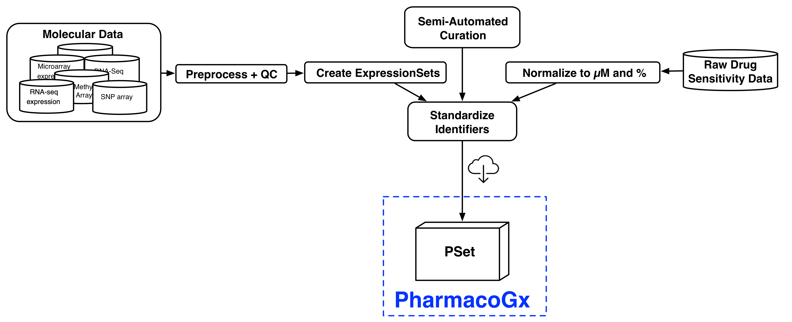

## Instructor(s) name(s) and contact information

* Petr Smirnov <petr.smirnov@uhnresearch.ca>
* Arvind Mer <arvind.mer@uhnresearch.ca>
* Christopher Eeles <christopher.eeles@uhnresearch.ca>


## Workshop Description

This workshop will focus on the synergies between analysis results from the PharmacoGx, Xeva and RadioGx packages and their usefulness for discovery of biomarkers of drug and/or radiation sensitivity in cancer cell lines (CCLs) and patent derived xenograft models (PDXs). We will discuss issues with data curation, consistency and reproducibility within the literature as well as illustrate the importance of unified analytical platforms, data and code sharing in bioinformatics and biomedical research. In this lab learners will be led through an analysis for each of the three packages on data provided by the download functions within them. The results of these analyses will then be explored to highlight how drug and radiation dose-response profiles in CCLs and PDXs can be used to discover potential synergistic biomarkers for drug-radiation and drug combination therapies. The resulting biomarkers will be discussed in the context of translational cancer research and clinical applications of genomic data. We will conclude with a discussion of how these biomarkers can be used to inform future in vitro and in vivo treatment screenings and ultimately provide useful insights for clinical trial design. 

### Pre-requisites

List any workshop prerequisites:

* Basic knowledge of R syntax
* Knowledge of or interest in pharmacogenomics and radio-genomics
* Familiarity with base bioconductor objects, including the SummarizedExperiment Class
* Familiarity with linear modelling in R; ANOVA, and goodness of fit tests


List relevant background reading for the workshop, including any
theoretical background you expect students to have.

* Smirnov, P. et al. PharmacoGx: An R package for analysis of large pharmacogenomic datasets. Bioinformatics 32, 1244–1246 (2016).
* Manem, V. SK. et al. Modeling Cellular Response in Large-Scale Radiogenomic Databases to Advance Precision Radiotherapy. Cancer Research (2019) doi:10.1158/0008-5472.CAN-19-0179.
* Mer, A. S. et al. Integrative pharmacogenomics analysis of patient-derived xenografts. Cancer Res canres.0349.2019 (2019) doi:10.1158/0008-5472.CAN-19-0349.


### Workshop Participation

Participants expected to have the following required packages installed on their machines to be able to run the commands along with the instructors.
PharmacoGx,  Xeva, RadioGx, CoreGx and Biobase from Bioconductor
The workshop will be presented as a set of analysis steps to be replicated by the learners, with instructors available to explain the why and how of applying these functions to the given datasets. Learners will write analysis scripts as well as use interactive commands to explore the generated data structures and results. Learners will then brainstorm potential applications of the analysis results in their field as well as comment on use case examples presented by the instructors on research in our lab.

### _R_ / _Bioconductor_ packages used

Bioconductor:

* https://bioconductor.org/packages/release/bioc/html/PharmacoGx.html
* http://bioconductor.org/packages/release/bioc/html/Xeva.html
* https://cran.r-project.org/web/packages/RadioGx/index.html
  * RadioGx is currental available in the devel version of Bioconductor
* https://cran.r-project.org/web/packages/CoreGx/index.html
  * CoreGx is currently being prepared for inclusion in Bioc 3.11 release in April/May; it abstracts shared functionality between the expanding set of ...Gx packages our lab has developed and will be a dependency

## Time outline

For a 2-hr workshop:

| Activity                                    | Time |
|---------------------------------------------|------|
| Introduction                                                | 5m   |
| Data Structure and Common Functions Between Packages     | 10m |
| Basic functionalities of PharmacoGx                     | 10m |
| Basic functionalities of Xeva                     | 10m |
| Basic functionalities of RadioGx                     | 10m |
| Data Analysis Walkthrough                         | 30m |
| Understanding Analysis Results and Synergies            | 10m |
| Use Case Discussion: Translational Science             | 15m |


## Workshop goals and objectives

### Learning goals

* Describe pharmacogenomic datasets and radiogenomic datasets and usefulness in cancer research
* Learn how to extract information from these datasets and to intersect them over their common measured features, experiments, model systems 
* Learn how to visualize experimental results from these datasets 
* Learn how to model dose-response for both small compound and radiotherapy datasets
* Learn measures to quantify the response in both cell line and PDX sensitivity screens, for both drug and radiation treatments
* Understand the differences in experimental design between radiotherapy and small compound treatments in cell lines
* Understand the differences in measuring response to therapy between cell line and PDX based models
* Understand how to choose the appropriate sensitivity quantification metric for your task 
* Understand how to identify potential genomic signatures of drug and radiation response and explore how synergies between these signatures can inform clinical trial design

### Learning objectives

* List available standardized pharmacogenomic and radiogenomic datasets and download them
* Access the molecular features, dose-response and metadata contained within the data structures defined in the packages
* Create drug-dose and radiation-dose response plots for cell line experiments
* Create tumor growth curve plots for PDX experiments
* Fit linear-quadratic models to radiotherapy experiments in cell lines
* Fit Hill Slope models to dose-response experiments using small compound treatments in cell lines
* Calculate the AAC, AUC, IC50, SF2, D10 metrics for response quantification in cell lines
* Calculate the mRECIST, Slope, ABC, linear mix model and other tumour growth curve summary metrics
* Visualize response of PDX experiments using an Oncoprint heatmap
* Predict in vivo and in vitro univariate biomarkers using the PharmacoGx, Xeva and RadioGx packages
* Compare signatures of response between chemotherapy compounds and radiotherapy
* Compare univariate biomarkers between cell line and PDX experiments


```{r setup, include=FALSE}
knitr::opts_chunk$set(echo = TRUE)
library(GxBioc2020Workshop)
library(PharmacoGx)
library(CoreGx)
```

## Introduction
This tutorial, titled Biomarker Discovery from High Throughput Screening Datasets, focuses on a suite of packages designed to 
simplify analysis correlating measures of treatment response measured on model systems with molecular profiles of those systems.
These packages primarly focus on modeling response to cancer treatments in cancer models, but the concepts presented can be 
applied to other disease types, given availability of data for the area of interest. 

The first two of the packages, `r BiocStyle::Biocpkg("PharmacoGx")` and `r BiocStyle::Biocpkg("RadioGx")` focus on screens done 
using cell lines as a model system. PharmacoGx focuses on modeling and predicting the response of cell lines treated with small 
molecule therapies. RadioGx swaps the small molecule treatment for irradiation of cell lines. The third package, 
`r BiocStyle::Biocpkg("Xeva")`, looks at treatment response for _in vivo_ systems, primarily Patient Derived Xenographs of cancer
tumours growing in immune compromised mice. 


## Data Structure and Common Functions Between Packages

While the experiments analyzed by the three packages are different, the workflow
that these packages are designed to accommodate has many similarities between
them. First and foremost, all three packages were developed to provide data structures to package together
the screening and molecular data, as well as all related metadata, for complete studies. 


## Basic Functionalities of PharmacoGx

`r BiocStyle::Biocpkg("PharmacoGx")` was developed to serve as a platform for
integrating analysis across different pharmacogenomic datasets. The main focus
of the PharmacoGx package is to provide access to pharmacogenomics datasets that
have been preprocessed with a uniform pipeline, and extensively curated to
ensure maximum overlap and consistency. The package is designed around on a
level of abstraction from the raw experimental data, and allows
bioinformaticians and biologists to work with data at the level of genes, drugs
and cell lines. This provides a more intuitive interface and, in combination
with unified curation, simplifies analyses between multiple datasets. The
purpose of this section is to familiarize the reader with the basic design of a
high throughput drug screen, introduce the PSet, an object which stores all the
data related to a pharmacogenomics study, and introduces the datasets which we
will be using in  this tutorial. 


PharmacoGx was made to unify the preprocessing and annotation between public 
Pharmacogenomics studies, so that the analyst can spend less time in data
sanitization, and skip straight to the analysis. As such, PharmacoSets for 
major datasets are available for download from our servers. These PSets all went
through a unified Preprocessing, QC, Normalization and Annotation  Pipeline.




### PharmacoSet Structure

PharmacoGx and RadioGx share many simularities, both in the design of experiments between the two packages, 
and subsequently in the 

The basic structure of a PharmacoSet is as follows:


### Downloading PharmacoSet objects
Let us download the PSets used for this tutorial into our local working environment. 
A table of available PharmacoSet objects can be obtained by using the *availablePSets*
function. 
```{r avail_psets, eval=FALSE}
  library(PharmacoGx)
  availablePSets()
```

If you look through the table produced by availablePSets, you will notice that 
each PSet object is downloaded from Zenodo - an Open Science project supported by
the European Commision and CERN. Each PSet is assigned a DOI, which can be used
to uniquely identify the data used in your analysis and retrieve it in the future 
for research reproducibility.  

Any of the PharmacoSets in the table can then be downloaded by calling
*downloadPSet*, which saves the datasets into a directory of the users choice,
and returns the data into the R session. Lets try downloading the GDSC and CCLE
PSets. The following code is included as an example, but not run, as the objects
were preloaded onto the VM for the workshop. 
```{r download_psets, eval=FALSE}
  GDSC <- downloadPSet("GDSC_2020(v1-8.2)", saveDir=file.path(".", "PSets"))
  CCLE <- downloadPSet("CCLE_2015", saveDir=file.path(".", "PSets"))
```

To load the datasets used in this workshop, we run the following code:
```{r load_psets, eval=TRUE}
data(GDSC)
data(CCLE)
```


### Working with PSets

For most of your work with PSet objects, we recommend you use the accessor
functions implemented in the package to access the data stored in the object.
For example, here we can use the *cellInfo* function to pull out the tissue of
origin for each cell line in the CCLE dataset. The *tissueid* column is standard
for PSets, and should be present in all objects.

```{r piechart, fig.cap="Tissue of origin of cell lines in CCLE study"}
mycol <- c("#8dd3c7","#ffffb3","#bebada","#fb8072","#80b1d3","#fdb462",
           "#b3de69","#fccde5","#d9d9d9","#bc80bd","#ccebc5","#ffed6f",
           "#a6cee3","#1f78b4","#b2df8a","#33a02c","#fb9a99","#e31a1c",
           "#fdbf6f","#ff7f00","#cab2d6","#6a3d9a","#ffff99","#b15928")
pie(table(CCLE@cell[,"tissueid"]), 
    col=mycol, 
    main="Tissue types", 
    radius=1, 
    cex=0.8)
```

While we will introduce some of the functions for working with PSets in this
tutorial, the documentation of the PharmacoSet object contains descriptions of
the available functions to interface with PSet objects:

```{r docs, eval=FALSE}
?`PharmacoSet-class`
```

PSets can be subsetted by refering directly to the drugs and cell lines you want
to keep in the dataset. For example, we can subset the GDSC PSet in the following 
ways:

```{r subsets, eval=TRUE}
print(GDSC)
print(drugNames(GDSC)[1])
print(subsetTo(GDSC, drugs="Erlotinib"))
print(GDSC["YT","Erlotinib"])

```

As an exercise, lets manually compute the number of overlaping cell lines and
drugs between CCLE and GDSC. Try it yourself! 

If you noticed as you completed the previous exercise, cell line and drug names 
are standardized between PSets downloaded using the *downloadPSet* function. 

PharmacoGx also implements a convenience function to intersect PSets:

```{r intersect, echo=TRUE, eval=FALSE}

common <- intersectPSet(list(CCLE, GDSC), intersectOn=c("drugs", "cell.lines"))
print(common)

```

### Fitting Drug Dose Response Curves

One of the core tasks implemented in PharmacoGx is the fitting of Hill Curve
Models to dose-response data. In PharmacoGx, we use the 3 Parameter Hill Slope
function as our model of drug response in cancer cell lines:

To fit a Hill Slope model to you data, you can use the *logLogisticRegression*
function, as below:

```{r loglogistic}

concentrations <- 1/2^seq(0,8) * 1
viabilities <-  c(0, 33.3, 60, 77.8, 88.2, 93.9, 96.9, 98.4, 99.2)

pars <- logLogisticRegression(conc = concentrations, viability = viabilities)
print(pars)
```


### Plotting Drug Dose Response Data

Drug-Dose response data included in the PharmacoSet objects can be conviniently
plotted using the *drugDoseResponseCurve* function. Given a list of
PharmacoSets, a drug name and a cell name, it will plot the drug dose response
curves for the given cell-drug combination in each dataset, allowing direct
comparisons of data between datasets.

```{r curves}
cells <- c("OCI-AML2","A253","NCI-H1648")
par(mfrow=c(1, 3), pty = "s")
drugDoseResponseCurve(drug="lapatinib", cellline=cells[1], 
                      pSets=list(CCLE, GDSC), plot.type="Fitted", 
                      legends.label="auc_published")
drugDoseResponseCurve(drug="lapatinib", cellline=cells[2], 
                      pSets=list(CCLE, GDSC), plot.type="Fitted", 
                      legends.label="auc_published")
drugDoseResponseCurve(drug="lapatinib", cellline=cells[3], 
                      pSets=list(CCLE, GDSC), plot.type="Fitted", 
                      legends.label="auc_published")
```

The function *drugDoseResponseCurve* can also be used to plot your own drug dose response curves, as follows:

```{r ddrc_own}

concentrations <- 1/2^seq(0,8) * 1
viabilities <-  c(0, 33.3, 60, 77.8, 88.2, 93.9, 96.9, 98.4, 99.2)

drugDoseResponseCurve(concentrations = list("Exp 1" = concentrations), viabilities = list("Exp 1" = viabilities))

```


### Computing Summary Measures for DDRCs

Often with in vitro Pharmacogenomics data, we want to compare the drug sensitivity of a cell line 
to some omic feature. For this, we want to summarize the drug dose response curve into a single 
number representing the sensitivity of the cell line. The IC50 and Area Above the curve are two
convenient metrics for quuantifying the observed drug sensitivity. If you noticed above, 
the *drugDoseResponseCurve* function computes them by default. In PharmacoGx, they can be 
computed manually as follows:

```{r sens_own}

concentrations <- rev(1/2^seq(0,8) * 1)
viabilities <-  c(99.2, 98.4, 96.9, 93.9, 88.2, 77.8, 60, 33.3, 0)

print(computeAUC(concentration = concentrations, viability = viabilities))
print(computeIC50(concentration = concentrations, viability = viabilities))

```

In *PharmacoGx*, we call these measures sensitivity measures. PSets come with
these measures precomputed, and accessible using the *sensitivityProfiles*
function:

```{r sensProf}
head(sensitivityProfiles(CCLE))
```


### Summary Functions

Pharmacogenomics studies often contain many examples of either replicated or
missing data. One of the most common tasks in preparing data for statistical or
machine learning analysis is aligning your features and labels. To accelerate
using Pharmacogenomics data for analysis, *PharmacoGx* contains two functions
which create deduplicated matrices with missing data filled by NAs:
*summarizeSensitivityProfiles* and *summarizeMolecularProfiles*. They create
matrices which are drugs x cell lines and molecular features x cell lines, with
any cell lines profiled for only sensitivity or molecular features padded with
NA values. For the molecular profiles, the data is returned in a `r
BiocStyle::Biocpkg("Biobase")` *ExpressionSet* object, while drug sensitivity
data is returned as a matrix.

```{r summary}
dim(PharmacoGx::summarizeMolecularProfiles(CCLE, "rna"))
dim(PharmacoGx::summarizeSensitivityProfiles(CCLE))
```


Below, we use the summarizeMolecularProfiles function and ggplot to investigate the distributions of 
AUC values within CCLE.

```{r ccleaac, fig.cap="Cells response to drugs in CCLE"}
library(ggplot2, verbose=FALSE)
library(reshape2, verbose=FALSE)
CCLE.aac <- PharmacoGx::summarizeSensitivityProfiles(CCLE, sensitivity.measure = "aac_recomputed")
melted_data <- melt(CCLE.aac)
NA_rows <- unique(which(is.na(melted_data), arr.ind=T)[,1])
melted_data <- melted_data[-NA_rows,]
p <- ggplot(melted_data, aes(x=Var1,y=value)) +
  geom_boxplot(fill="gray") +
  theme(axis.text.x=element_text(angle=90,hjust=1)) +
  xlab("Drugs") +
  ylab("AAC")
print(p)
```


## Basic Functionalities of RadioGx

### Installing RadioGx

To install the RadioGx package, run:

```{r install_radiogx, eval=FALSE}
devtools::install_github('bhklab/RadioGx')
# BiocManager::install('RadioGx', version='devel') # Waiting on issue with Bioconductor credentials to be resolved so I can push updates
```
```{r load_package}
library(RadioGx)
```

### RadioSet

The RadioSet has a structure similar to the PharmacoSet and also inherits 
from the CoreSet class exported by CoreGx. The radiation slot is implemented in 
RadioGx to hold relevant metadata about the type of radiation used in the 
dose-response experiments for this dataset, and is analogous to the drug slot
in a PharmacoSet. The remainder of the slots mirror the PharmacoSet.

<!-- FIXME: Simplify this diagram -->
{ width=600px, height=600px }

### Cleveland Data Set

RadioGx provides an interface similar to PharmacoGx and Xeva for downloading
data sets we have curated.

To get a list of available RadioSets, use:

```{r available_rsets}
RSets <- availableRSets()
```

```{r available_radiosets_table}
print(colnames(RSets))
knitr::kable(RSets[, c("RadioSet_name", "Date_updated", "DOI")])
```
As the field of Radio-genomics is relatively new, there is currently only one dataset
available. Let's download the 'Cleveland' RSet, which contains a highly curated version of
the data from Yang *et al.*, 2016.

```{r download_rset}
## FIXME:: Add verbose=FALSE to availableRSets() call within downloadRSet
Cleveland <- downloadRSet('Cleveland', saveDir='.')
```

```{r printing_a_radioset}
Cleveland
```
Similar to PharmacoGx and Xeva, a summary of the contents of the RadioSet is printed
RadioSet is printed as the return when calling a RadioSet in the console. We can see
that the Cleveland RSet contains sensitivity information for 540 cell-lines treated
with a single type of radiation.

### Accessing Data

* Access the molecular features, dose-response and metadata contained within the data structures defined in the packages


### Fitting the Linear Quadratic (LQ) Model

RadioGx provides a number of functions for analyzing dose response experiments.
To use these functions, we must first fit a statistical model to the dose
response data. This package exports a function for fitting linear-quadratic
models to dose response data. The function can be used with data contained in
a RadioSet or with raw dose-response data.

```{r model_fit}
# Extract raw sensitvity data from the RadioSet
sensRaw <- sensitivityRaw(Cleveland)
paste('Third dimension:', paste0(dimnames(sensRaw)[[3]], collapse=', '))
```
```{r structure_sensitivity_raw}
str(sensRaw)
```
The data returned by `sensitivityRaw(RSet)` is a three dimensional
array, but it can also be thought of as a set of experiment by treatment
matrices. We can see by the `dimnames` of the third dimensions that
the first matrix holds the radiation dose (in Gy) for each experiment,
while the second matrix holds the viability measurements for the cell-line
after each dose in the experimental series.

```{r cellline_names}
# Find a cancer cell-line of interest
head(sensitivityInfo(Cleveland)$cellid)
```

```{r selecting_cancer_cell_line}
cancerCellLine <- sensitivityInfo(Cleveland)$cellid[1]
print(cancerCellLine)
```

```{r extracting_dose_response_data}
# Get the radiation doses and associated survival data from clevelandSmall
radiationDoses <- sensRaw[1, , 'Dose']
survivalFractions <- sensRaw[1, , 'Viability']
```

```{r fitting_lq_model}
LQmodel <- linearQuadraticModel(D=radiationDoses,
                                SF=survivalFractions)
LQmodel
```

Above we see that LQmodel contains the alpha and beta coefficients for the dose
response curve fit to the dose and viability data for the IMR-32 cancer cell-line.
Based on the $R^2$ attribute we can see that the model fit for this data is
good, with over 95% of observed variance explained by the model.


### Calculating Dose-Response Metrics

RadioGx provides a number of functions for calculating common dose response
metrics such as survival fraction (SF), area under the curve (AUC) and dose at
which only 10% of cancer cells survive (D10).

Some of these functions require the alpha and beta coefficients, as calculated
above using the `linearQuadraticModel` function.

```{r metrics_computed_from_fit_parameters}
survFracAfter2Units <- computeSF2(pars=LQmodel)
print(survFracAfter2Units)

dose10PercentSurv <- computeD10(pars=LQmodel)
print(dose10PercentSurv)
```
We see from the above code cell that after two units of radiation, approximately
`r (100 * survFracAfter2Units)` of cancer cells remain relative to the initial population.
Conversely, using `computeD10` we see that on average `r dose10PercentSurv` units of radiation
need to be administered to result in 10% cell-line survival (i.e., 90% of cancer cells
are killed).

Other dose-response metrics can be computed directly using the radiation dose
and cancer cell viability data.

```{r metrics_computed_from_dose_response_data}
areaUnderDoseRespCurve <- computeAUC(D=radiationDoses, pars=LQmodel, lower=0,
                                     upper=1)
print(areaUnderDoseRespCurve)

survFrac <- 1 - areaUnderDoseRespCurve
print(survFrac)
```

In the above code block we compute the AUC for a dose-response curve between a
dose of 0 to 1 Gy. This area can be interpreted as the proportion of cells
killed during the administration of 1 Gy of radiation, therefore the survival
fraction is equal to 1 - AUC. We see that 1 Gy of radiation killed ~70% of
cancer cell-line colonies, thus our survival fraction is ~30% or 0.3.

### Dose-Response Curves

The `doseResponseCurve` function can be used to generate plots of survival
fraction vs dose for radiation sensitivity experiments. In this example
we provide raw data values to create the plot. When the `plot.type` is set to
"Both", a linear-quadratic model will also be fit to the supplied dose-response
values.

```{r plotting_rad_dose_resp}
doseResponseCurve(
  Ds=list("Experiment 1" = c(0, 2, 4, 6)),
  SFs=list("Experiment 1" = c(1,.6,.4,.2)),
  plot.type="Both"
  )
```

Additionally, `doseResponseCurve` can be used to create dose response curves
directly from a curated RadioSet object. When utilizing this feature, a
cell-line must be selected from the RadioSet. This can be done by name
if you know which cell-line you are looking for. If you don't know which
cell-line you want to visualize, the available
cell-lines can be explored using the `cellInfo` function.

```{r plotting_rad_dose_resp_rSet}
doseResponseCurve(
  rSets=list(clevelandSmall),
  cellline=cellInfo(clevelandSmall)$cellid[3]
)
```


## Data Analysis Walkthrough


## Understanding Analysis Results and Synergies


## Use Case Discussion: Translational Science


--------


## How to add figures


## How to add citations

Cite like that: [@paper1]

## R Markdown

This is an R Markdown document. Markdown is a simple formatting syntax for authoring HTML, PDF, and MS Word documents. For more details on using R Markdown see <http://rmarkdown.rstudio.com>.

When you click the **Knit** button a document will be generated that includes both content as well as the output of any embedded R code chunks within the document. You can embed an R code chunk like this:

```{r cars}
summary(cars)
```

## Including Plots

You can also embed plots, for example:

```{r pressure, echo=FALSE}
plot(pressure)
```

Note that the `echo = FALSE` parameter was added to the code chunk to prevent printing of the R code that generated the plot.
