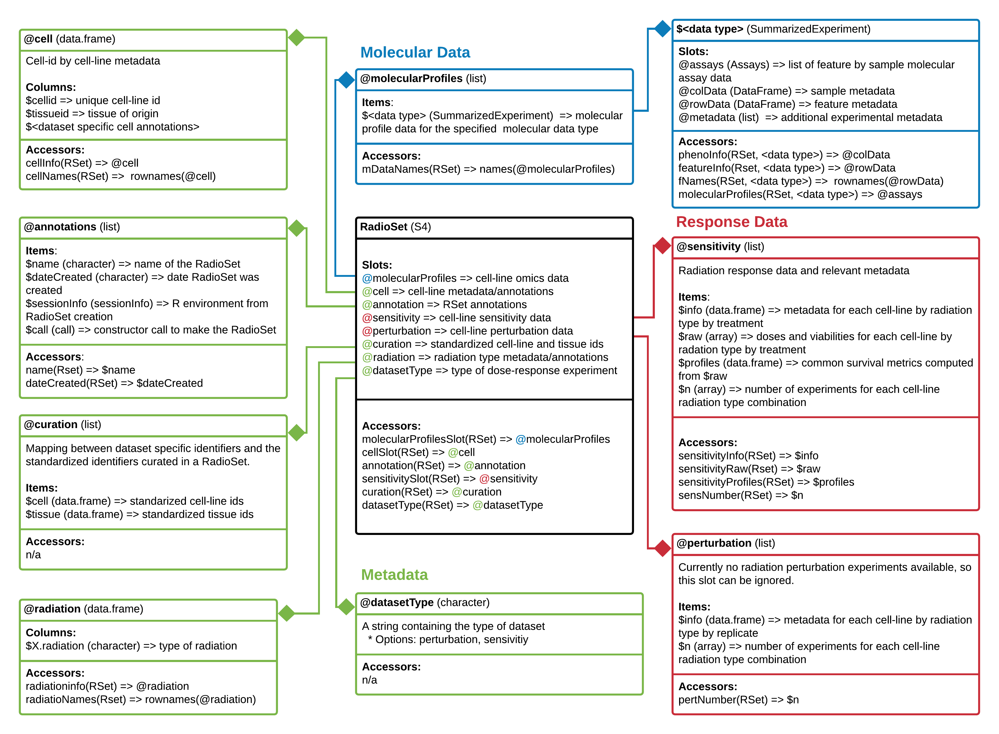

<!-- Remove {-} from header to show numbering -->
# Workshop Overview {-}

## Instructor(s) name(s) and contact information {-}

* Petr Smirnov <petr.smirnov@uhnresearch.ca>
* Arvind Mer <arvind.mer@uhnresearch.ca>
* Christopher Eeles <christopher.eeles@uhnresearch.ca>

## Workshop Description {-}

This workshop will focus on the synergies between analysis results from the `PharmacoGx`, `Xeva` and `RadioGx` packages and their usefulness for discovery of biomarkers of drug and/or radiation sensitivity in cancer cell lines (CCLs) and patent derived xenograft models (PDXs). We will discuss issues with data curation, consistency and reproducibility within the literature as well as illustrate the importance of unified analytical platforms, data and code sharing in bioinformatics and biomedical research. In this lab learners will be led through an analysis for each of the three packages on data provided by the download functions within them. The results of these analyses will then be explored to highlight how drug and radiation dose-response profiles in CCLs and PDXs can be used to discover potential synergistic biomarkers for drug-radiation and drug combination therapies. The resulting biomarkers will be discussed in the context of translational cancer research and clinical applications of genomic data. We will conclude with a discussion of how these biomarkers can be used to inform future in vitro and in vivo treatment screenings and ultimately provide useful insights for clinical trial design.

### Pre-requisites {-}

List any workshop prerequisites:

* Basic knowledge of R syntax
* Knowledge of or interest in pharmacogenomics and radio-genomics
* Familiarity with base bioconductor objects, including the SummarizedExperiment Class
* Familiarity with linear modelling in R; ANOVA, and goodness of fit tests


List relevant background reading for the workshop, including any
theoretical background you expect students to have.

* Smirnov, P. et al. PharmacoGx: An R package for analysis of large pharmacogenomic datasets. Bioinformatics 32, 1244–1246 (2016).
* Manem, V. SK. et al. Modeling Cellular Response in Large-Scale Radiogenomic Databases to Advance Precision Radiotherapy. Cancer Research (2019) doi:10.1158/0008-5472.CAN-19-0179.
* Mer, A. S. et al. Integrative pharmacogenomics analysis of patient-derived xenografts. Cancer Res canres.0349.2019 (2019) doi:10.1158/0008-5472.CAN-19-0349.


### Workshop Participation {-}

Participants expected to have the following required packages installed on their machines to be able to run the commands along with the instructors.
`PharmacoGx`,  `Xeva`, `RadioGx`, `CoreGx` and `Biobase` from Bioconductor
The workshop will be presented as a set of analysis steps to be replicated by the learners, with instructors available to explain the why and how of applying these functions to the given datasets. Learners will write analysis scripts as well as use interactive commands to explore the generated data structures and results. Learners will then brainstorm potential applications of the analysis results in their field as well as comment on use case examples presented by the instructors on research in our lab.

### _R_ / _Bioconductor_ packages used {-}

Bioconductor:

* https://bioconductor.org/packages/release/bioc/html/PharmacoGx.html
* http://bioconductor.org/packages/release/bioc/html/Xeva.html
* https://cran.r-project.org/web/packages/RadioGx/index.html
  * RadioGx is currently available in the devel version of Bioconductor
* https://cran.r-project.org/web/packages/CoreGx/index.html
  * CoreGx is currently available in the 3.11 release of Bioconductor

## Time outline {-}

For a 2-hr workshop:

| Activity                                    | Time |
|---------------------------------------------|------|
| Introduction                                                | 5m   |
| Data Structure and Common Functions Between Packages     | 10m |
| Basic functionalities of PharmacoGx                     | 10m |
| Basic functionalities of Xeva                     | 10m |
| Basic functionalities of RadioGx                     | 10m |
| Data Analysis Walkthrough                         | 30m |
| Understanding Analysis Results and Synergies            | 10m |
| Use Case Discussion: Translational Science             | 15m |


## Workshop goals and objectives {-}

### Learning goals {-}

* Describe pharmacogenomic datasets and radiogenomic datasets and usefulness in cancer research
* Learn how to extract information from these datasets and to intersect them over their common measured features, experiments, model systems 
* Learn how to visualize experimental results from these datasets 
* Learn how to model dose-response for both small compound and radiotherapy datasets
* Learn measures to quantify the response in both cell line and PDX sensitivity screens, for both drug and radiation treatments
* Understand the differences in experimental design between radiotherapy and small compound treatments in cell lines
* Understand the differences in measuring response to therapy between cell line and PDX based models
* Understand how to choose the appropriate sensitivity quantification metric for your task 
* Understand how to identify potential genomic signatures of drug and radiation response and explore how synergies between these signatures can inform clinical trial design

### Learning objectives {-}

* List available standardized pharmacogenomic and radiogenomic datasets and download them
* Access the molecular features, dose-response and metadata contained within the data structures defined in the packages
* Create drug-dose and radiation-dose response plots for cell line experiments
* Create tumor growth curve plots for PDX experiments
* Fit linear-quadratic models to radiotherapy experiments in cell lines
* Fit Hill Slope models to dose-response experiments using small compound treatments in cell lines
* Calculate the AAC, AUC, IC50, SF2, D10 metrics for response quantification in cell lines
* Calculate the mRECIST, Slope, ABC, linear mix model and other tumour growth curve summary metrics
* Visualize response of PDX experiments using an Oncoprint heatmap
* Predict in vivo and in vitro univariate biomarkers using the PharmacoGx, Xeva and RadioGx packages
* Compare signatures of response between chemotherapy compounds and radiotherapy
* Compare univariate biomarkers between cell line and PDX experiments


```{r setup, include=FALSE}
knitr::opts_chunk$set(echo = TRUE)
```

# Introduction
This tutorial, titled Biomarker Discovery from High Throughput Screening Datasets, focuses on a suite of packages designed to 
simplify analysis correlating measures of treatment response measured on model systems with molecular profiles of those systems.
These packages primarly focus on modeling response to cancer treatments in cancer models, but the concepts presented can be 
applied to other disease types, given availability of data for the area of interest. 

The first two of the packages, `r BiocStyle::Biocpkg("PharmacoGx")` and `r BiocStyle::Biocpkg("RadioGx")` focus on screens done 
using cell lines as a model system. PharmacoGx focuses on modeling and predicting the response of cell lines treated with small 
molecule therapies. RadioGx swaps the small molecule treatment for irradiation of cell lines. The third package, 
`r BiocStyle::Biocpkg("Xeva")`, looks at treatment response for _in vivo_ systems, primarily Patient Derived Xenographs of cancer
tumours growing in immune compromised mice. 


# Data Structure and Common Functions Between Packages

While the experiments analyzed by the three packages are different, the workflow that these packages are designed to accommodate
has many similarities between them. First and foremost, all three packages were developed to provide


# Basic Functionalities of PharmacoGx

`r BiocStyle::Biocpkg("PharmacoGx")` was developed to serve as a platform for
integrating analysis across different pharmacogenomic datasets. The main focus of the
`r BiocStyle::Biocpkg("PharmacoGx")` package is to provide access to
pharmacogenomics datasets that have been preprocessed with a uniform pipeline,
and extensively curated to ensure maximum overlap and consistency. The package is designed around
on a level of abstraction from the raw experimental data, and
allows bioinformaticians and biologists to work with data at the level of genes,
drugs and cell lines. This provides a more intuitive interface and, in
combination with unified curation, simplifies analyses between multiple
datasets. The purpose of this section is to familiarize the reader with the basic design of a
high throughput drug screen, introduce the PSet, an object which stores all the data
related to a pharmacogenomics study, and introduces the datasets which we will be using in 
this tutorial. 


# Basic Functionalities of RadioGx

## Installing RadioGx

To install the `r BiocStyle::Biocpkg('RadioGx')` package, run:

```{r install_radiogx, eval=FALSE, message=FALSE}
devtools::install_github('bhklab/RadioGx')
# BiocManager::install('RadioGx', version='devel') # Waiting on issue with Bioconductor credentials to be resolved so I can push updates
```

```{r load_package, message=FALSE}
library(RadioGx)
```

## RadioSet

The RadioSet has a structure similar to the `PharmacoSet` and also inherits
from the CoreSet^[exported by `r BiocStyle::Biocpkg('CoreGx')`] class . The radiation
slot is implemented in `r BiocStyle::Biocpkg('RadioGx')`  to hold relevant metadata
about the type(s) of radiation used in the dose-response experiment,
and is analogous to the drug slot in a `PharmacoSet`. The remainder of the slots
mirror the `PharmacoSet`.

```{r radioset, echo=FALSE, fig.wide=TRUE, fig.cap = "**RadioSet class diagram**. Objects comprising a `RadioSet` are enclosed in boxes. First box indicates type and name of each object. Second box indicates the structure of an object or class. Third box shows accessor methods from `RadioGx` for that specific object. '=>' represents return and specifies what is returned from that item or method."}

```

## Downloading an RSet

`r BiocStyle::Biocpkg('RadioGx')` provides an interface similar to `r BiocStyle::Biocpkg("PharmacoGx")`
and `r BiocStyle::Biocpkg('Xeva')` for downloading our curated versions of published datasets.

To get a list of available `RadioSet`s, use:

```{r available_rsets, message=FALSE}
RSets <- availableRSets()
```

```{r available_radiosets_table, echo=FALSE}
knitr::kable(RSets[, c("RadioSet_name", "Date_updated", "DOI")])
```

As the `r BiocStyle::Biocpkg('RadioGx')` package was only recently released, there is
currently only one dataset available. Let's download the 'Cleveland' RSet, which contains
a highly curated version of the data from Yang *et al.*, 2016.

```{r download_rset}
Cleveland <- downloadRSet('Cleveland', saveDir='.')
```

```{r printing_a_radioset, hide=TRUE}
Cleveland
```

Similar to PharmacoGx and Xeva, a summary of the contents of the RadioSet is printed
when calling a RadioSet in the console. We can see that the Cleveland RSet contains
sensitivity information for 540 cell-lines treated with a single type of radiation.
The RSet also contains rna^[microarray], rna-seq and cnv molecular data for a subset of available
cell-lines.

## Accessing Data

RadioGx stores three major categories of data: metadata/annotations, molecular data and radiation response data.
These are demarcated in **Fig.** \@ref(fig:radioset) using green, blue and red, respectively. Accessor methods are available
to retrieve all three kinds of data from an RSet; the accessor methods for each component are listed
in the bottom most cell of each object in the RadioGx class diagram. We will discuss a subset of these methods
now.

### Accessing metadata

Metadata in an RSet is stored in the same slots as in a `PharmacoSet`, and can be accessed using the same
generic accessor functions as in `r BiocStyle::Biocpkg('PharmacoGx')`. A unique slot, `radiation` has additional
accessor methods to retrieve the radiation types used in a given sensitivity experiment.

```{r radiation_info_accessor}
# Get the radiation info data.frame from an RSet
radInf <- radiationInfo(Cleveland)
```

```{r print_radinf, fig.wide = TRUE}
knitr::kable(radInf)
```

Currently, only one type of radiation has been used in an `RSet`. However, we hope to add new `RSet`s covering a wider range of radiation
sensitivity and perturbation experiments in the near future. The following method is also available to retrieve the radiation
types as a `character` vector instead of a `data.frame`.

```{r radiation_types_accessor}
radTypes <- radiationTypes(Cleveland)
radTypes
```
### Accessing molecular data

Molecular data in an `RSet` is contained in the `molecularProfiles` slot and can be accessed the same way it is for a `PSet`.

```{r molecular_data_slot_accessors}
# Get the list (equivalent to @molecularProfiles, except that it is robust to changes in RSet structure
str(molecularProfilesSlot(Cleveland), max.level=2)

# Get the names from the list
mDataNames(Cleveland)
```

All molecular data in an RSet (any class inheriting from CoreSet, actually) is contained in a `SummarizedExperiment`
object. While `r BiocStyle::Biocpkg('SummarizedExperiment')` comes with it's own set of accessors, we recommend using
available `r BiocStyle::Biocpkg('RadioGx')` accessor methods as it allows your scripts to be robust to future changes
in the structure of a `RadioSet` object.

```{r sample_meta_data}
# Get sample metadata
phenoInf <- phenoInfo(Cleveland, 'cnv')
```

To keep the document formatted nicely, the following tables have been subset to the first three rows and columns.

```{r print_sample_meta_data, echo=FALSE, fig.small=TRUE}
knitr::kable(phenoInf[1:3, 1:3], row.names=FALSE)
```

```{r feature_meta_data}
# Get feature metadata
featInfo <- featureInfo(Cleveland, 'rna')
```

```{r print_feature_meta_data, echo=FALSE, align="center"}
knitr::kable(featInfo[1:3, 1:3], row.names=FALSE)
```

```{r molecular_data, fig.wide=TRUE}
# Access the moleclar feature data
mProf <- molecularProfiles(Cleveland, 'rnaseq')
```

```{r print_molecular_profile_data, echo=FALSE}
knitr::kable(mProf[1:3, 1:3])
```

### Accessing response data

Data from radiation sensitivity and/or perturbation experiments is also retrieved the same way it is for a PSet. Currently,
only sensitivity experiments have been included in a `RadioSet`.

```{r response_data_accessors}
# Get sensitivity slot
sens <- sensitivitySlot(Cleveland)
```

```{r }
# Get sensitivity raw data
sensRaw <- sensitivityRaw(Cleveland)
```

```{r }
# Get sensitivity profiles
sensProf <- sensitivityProfiles(Cleveland)
```

``{r }
# Get sensitivity info
sensInfo <- sensitivityInfo(Cleveland)
```

## Fitting Linear Quadratic (LQ) Models

RadioGx provides a number of functions for analyzing dose response experiments.
To use these functions, we must first fit a statistical model to the dose
response data. This package exports a function for fitting linear-quadratic
models to dose response data. The function can be used with data contained in
a RadioSet or with raw dose-response data.

```{r model_fit}
# Extract raw sensitvity data from the RadioSet
sensRaw <- sensitivityRaw(Cleveland)
```

```{r structure_sensitivity_raw}
str(sensRaw)
```

The data returned by `sensitivityRaw(RSet)` is a three dimensional
array, but it can also be thought of as a set of experiment by treatment
matrices. We can see by the `dimnames` of the third dimensions that
the first matrix holds the radiation dose (in Gy) for each experiment,
while the second matrix holds the viability measurements for the cell-line
after each dose in the experimental series.

```{r cellline_names}
# Find a cancer cell-line of interest
head(sensitivityInfo(Cleveland)$cellid)
```

```{r selecting_cancer_cell_line}
cancerCellLine <- sensitivityInfo(Cleveland)$cellid[1]
print(cancerCellLine)
```

```{r extracting_dose_response_data}
# Get the radiation doses and associated survival data from clevelandSmall
radiationDoses <- sensRaw[1, , 'Dose']
survivalFractions <- sensRaw[1, , 'Viability']
```

```{r fitting_lq_model}
LQmodel <- linearQuadraticModel(D=radiationDoses,
                                SF=survivalFractions)
LQmodel
```

Above we see that LQmodel contains the alpha and beta coefficients for the dose
response curve fit to the dose and viability data for the IMR-32 cancer cell-line.
Based on the $R^2$ attribute we can see that the model fit for this data is
good, with `r round(attributes(LQmodel)$Rsquare,3 ) * 100`% of observed variance
explained by the model.

## Calculating Dose-Response Metrics

RadioGx provides a number of functions for calculating common dose response
metrics such as surviving fraction (SF), area under the curve (AUC) and dose at
which only 10% of cancer cells survive (D10).

Some of these functions require the alpha and beta coefficients, as calculated
above using the `linearQuadraticModel` function.

```{r metrics_computed_from_fit_parameters}
survFracAfter2Units <- computeSF2(pars=LQmodel)
print(survFracAfter2Units)

dose10PercentSurv <- computeD10(pars=LQmodel)
print(dose10PercentSurv)
```
We see from the above code cell that after two units of radiation,
`r round(100 * survFracAfter2Units, 3)`% of cancer cells remain relative to the initial population.
Conversely, using `computeD10` we see that on average `r round(dose10PercentSurv, 3)` units of radiation
need to be administered to result in 10% cell-line survival (i.e., 90% of cancer cells
are killed).

Other dose-response metrics can be computed directly using radiation dose
and cancer cell viability data.

```{r metrics_computed_from_dose_response_data}
areaUnderDoseRespCurve <- computeAUC(D=radiationDoses, pars=LQmodel, lower=0,
                                     upper=1)
print(areaUnderDoseRespCurve)
```

In the above code block we compute the AUC for a dose-response curve between a
dose of 0 to 1 Gy. This area can be interpreted as the total proportion of cells
killed during the administration of 1 Gy of radiation.

### Dose-Response Curves

The `doseResponseCurve` function can be used to generate plots of surviving
fraction vs dose for radiation sensitivity experiments. In this example
we provide raw data values to create the plot. When the `plot.type` is set to
"Both", a linear-quadratic model will also be fit to the supplied dose-response
values.

```{r plotting_rad_dose_resp, fig.small=TRUE}
doseResponseCurve(
  Ds=list("Experiment 1" = c(0, 2, 4, 6)),
  SFs=list("Experiment 1" = c(1,.6,.4,.2)),
  plot.type="Both"
)
```

Additionally, `doseResponseCurve` can be used to create dose response curves
directly from a curated RadioSet object. When utilizing this feature, a
cell-line must be selected from the RadioSet. This can be done by name
if you know which cell-line you are looking for. If you don't know which
cell-line you want to visualize, the available
cell-lines can be explored using the `cellInfo` function.

```{r plotting_rad_dose_resp_rSet, fig.small=TRUE}
doseResponseCurve(
  rSets=list(clevelandSmall),
  cellline=cellInfo(clevelandSmall)$cellid[3]
)
```

### Summarizing Sensitivity

To retrieve a radiation type by cell-line summary of a sensitivity experiment, we use the `summarizeSensitivityProfiles` function.
This will return a `matrix` where rows are radiation type^[Note there is currently only one radiation type available, but in the future there will be more], columns are cell-line and values are viability measurements summarized
using `summary.stat`^[Available options are 'mean', 'median', 'first', 'last']. The sensitivity measure to summarize can be
specified using `sensitivity.measure`^[See `sensitivityMeasures(RSet)` for available options].

```{r summarize_sensitivity}
sensSummary <- summarizeSensitivityProfiles(Cleveland)
```

```{r show_summarized_sensivitiy}
sensSummary[, 1:3]
```

### Summarizing Molecular Data

```{r summarize_molecular_data}
mprofSummary <- RadioGx::summarizeMolecularProfiles(Cleveland, mDataType='rna', summary.stat='median', fill.missing=FALSE)
```

```{r show_summarized_sensitivity}
mprofSummary
```
Due to a lack of replicates in the Cleveland `RSet`, the returned `SummarizedExperiment` object contains the same information as
the original. For other experiments with replicates, however, the result should contain one column per unique cell-line id. For
ease of interoperability with the response data contained in an `RSet`, if `fill.missing` is `r FALSE` empty columns for the
cell-lines in the sensitivity experiment, but not in the molecular profile will be added to the `SummarizedExperiment` such
that the dimensions are equal.

### Molecular Signatures for Biomarker Discovery

The true usefulness of the `RadioGx` packages comes from the ability to determine gene signatures for a
cell-lines from a sensitivity experiment. Cell-lines of interest to a given researcher can be selected
and a molecular signature computed which correlates specific molecular features with a given sensitivity profile.
Using this method one could identify signatures associated with either radio-sensitivity or radio-resistance.
Combining this signature with drug response gene signatures from `r BiocStyle::Biocpkg('PharmacoGx')`, as will
be done in the subsequent section, one can identify drugs which could augment the effectiveness of a
given radiation signature. Perhaps more powerfully, drugs which target features associated with radio-resistance
can be found, potentially synergistically increasing the overall effectiveness of the combine treatment.

```{r compute_molecular_signature}
radSensSig <- radSensitivitySig(Cleveland, mDataType='rna', features=fNames(Cleveland, 'rna')[2:5], nthread=15)
```


```{r exploring_molecular_signature}
radSensSig@.Data
```

# Data Analysis Walkthrough


# Understanding Analysis Results and Synergies


# Use Case Discussion: Translational Science
